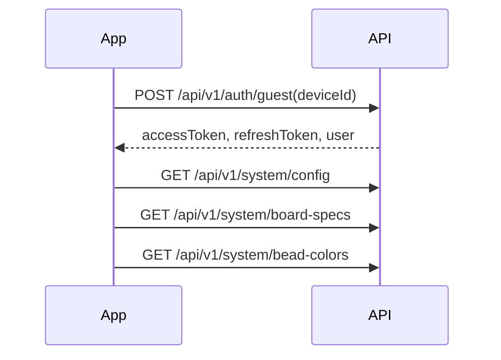
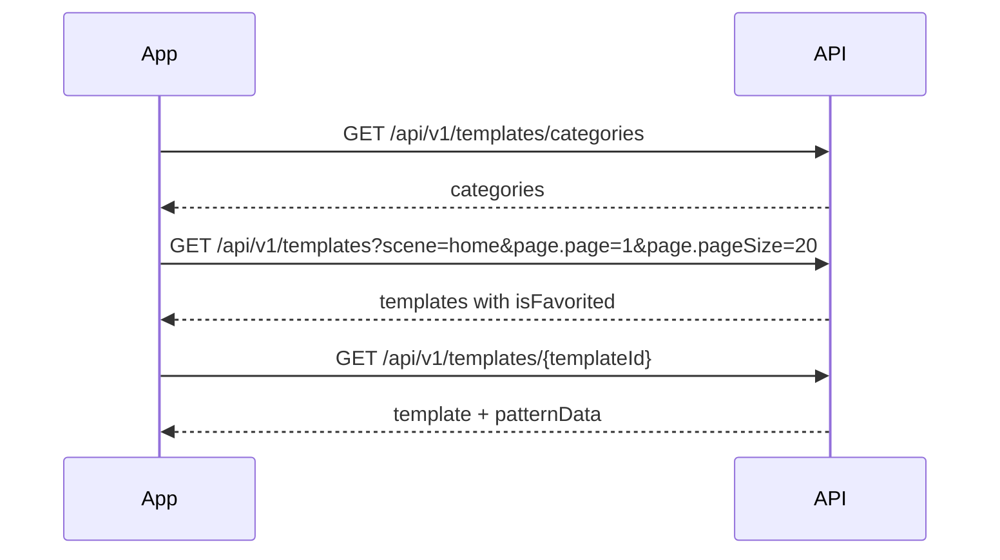
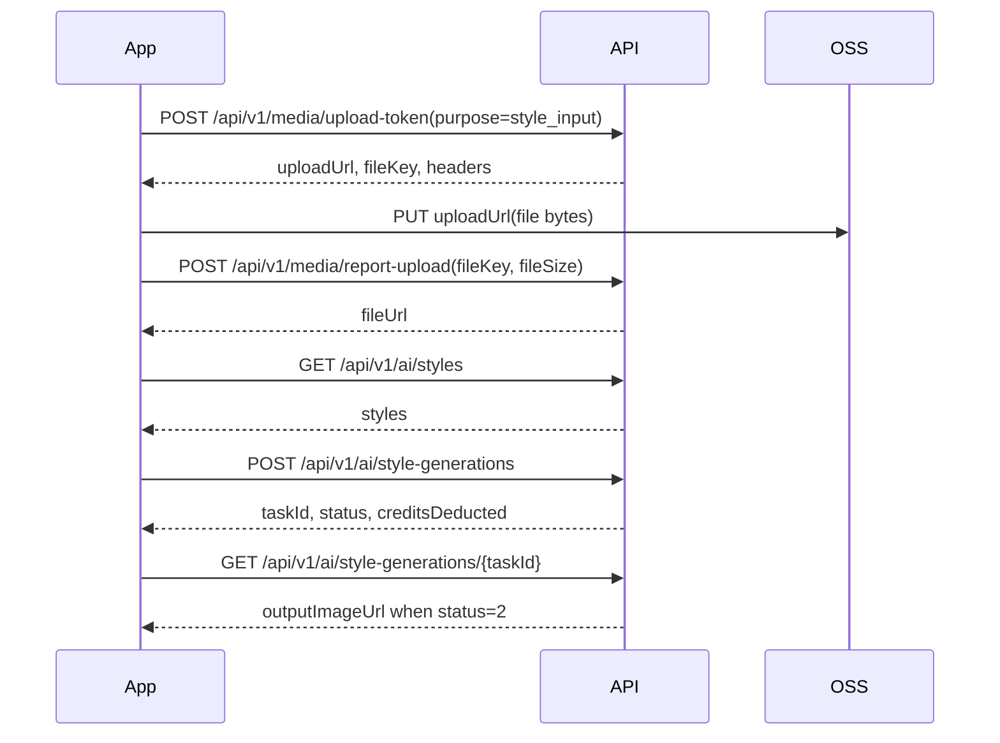
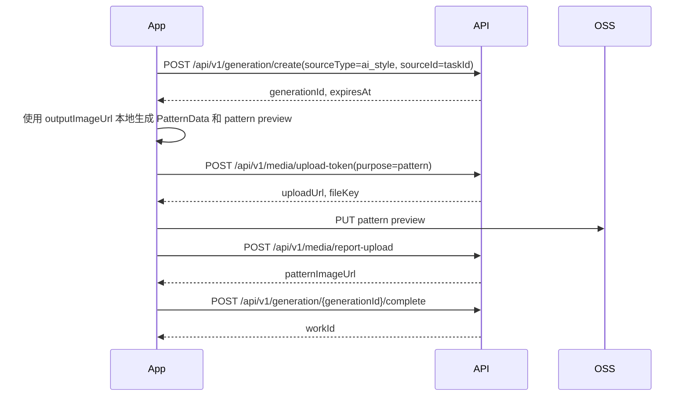

# Flutter 客户端后端接口对接文档

本文给 Flutter 客户端开发者使用，基于当前后端 proto、handler、service 的已实现代码整理。示例默认走 REST，也就是 gRPC-Gateway 暴露的 `/api/v1/...` 接口。移动端如果后续改用 gRPC，可以直接用 `pkg/proto/*.proto` 生成 Dart client，字段语义相同。

## 1. 接入范围

当前 Flutter 首期重点对接这些能力：

1. 启动后登录或游客登录，拿到 `accessToken`。
2. 首页展示官方图纸，支持分类、列表、详情、收藏。
3. 风格转换页展示 AI 风格，上传图片，创建 AI 风格转换任务，轮询结果。
4. 用户把 AI 输出图继续生成拼豆图纸，再保存到服务端。
5. “我的”页面展示我的生成记录、我的官方图纸收藏、我的 AI 风格转换记录。

配套接口：

| 能力 | 主要接口 |
|---|---|
| 登录 | `POST /api/v1/auth/guest`、`POST /api/v1/auth/phone`、`POST /api/v1/auth/refresh` |
| 官方图纸 | `GET /api/v1/templates`、`GET /api/v1/templates/{templateId}` |
| 官方图纸收藏 | `POST/DELETE /api/v1/templates/{templateId}/favorite`、`GET /api/v1/templates/favorites` |
| 图片上传 | `POST /api/v1/media/upload-token`、OSS `PUT`、`POST /api/v1/media/report-upload` |
| AI 风格转换 | `GET /api/v1/ai/styles`、`POST /api/v1/ai/style-generations`、`GET /api/v1/ai/style-generations/{taskId}` |
| 拼豆图纸生成记录 | `POST /api/v1/generation/create`、`POST /api/v1/generation/{generationId}/complete`、`GET /api/v1/works` |

## 2. 服务地址

本地开发默认：

| 协议 | 地址 |
|---|---|
| REST | `http://127.0.0.1:8080` |
| gRPC | `127.0.0.1:9090` |

Flutter 真机调试时不要用 `127.0.0.1` 指向电脑。需要改成电脑局域网 IP，例如：

```text
http://192.168.1.23:8080
```

## 3. 通用约定

### 3.1 请求头

除公开接口外，都要带 token。

```http
Authorization: Bearer <access_token>
Content-Type: application/json
X-Platform: ios
X-App-Version: 1.0.0
X-Device-Id: <stable-device-id>
```

`X-Platform` 可选值：

| 值 | 说明 |
|---|---|
| `ios` | iOS |
| `android` | Android |
| `miniprogram` | 小程序 |
| `web` | Web |

当前后端鉴权主要读取 `Authorization`。`X-Platform` 会进入上下文，后续支付、埋点、灰度可以使用。

### 3.2 公开接口

这些接口不需要 token：

- `POST /api/v1/auth/guest`
- `POST /api/v1/auth/phone`
- `POST /api/v1/auth/sms/send`
- `POST /api/v1/auth/wechat`
- `POST /api/v1/auth/apple`
- `POST /api/v1/auth/refresh`
- `GET /api/v1/system/config`
- `GET /api/v1/system/update`
- `GET /api/v1/system/banners`
- `GET /api/v1/system/bead-colors`
- `GET /api/v1/system/board-specs`
- `GET /api/v1/community/feed`
- `GET /api/v1/community/posts/{postId}`

注意：官方图纸 `TemplateService` 当前不是公开接口。客户端启动后先游客登录，再请求首页图纸。

### 3.3 JSON 字段命名

REST 默认使用 proto JSON 的 lowerCamelCase：

| Proto 字段 | REST JSON 字段 |
|---|---|
| `access_token` | `accessToken` |
| `client_request_id` | `clientRequestId` |
| `input_file_key` | `inputFileKey` |
| `pattern_data` | `patternData` |
| `page_size` | `pageSize` |
| `is_favorited` | `isFavorited` |

GET query 参数也支持 proto text name 和 JSON name。Flutter 侧建议统一用 lowerCamelCase：

```text
GET /api/v1/templates?scene=home&page.page=1&page.pageSize=20
```

如果你封装底层 client，可以同时兼容 `page.page_size`，但业务代码里保持一种写法。

### 3.4 响应格式

大多数业务错误不会通过 HTTP status 表示，而是放在响应体 `header.code`。客户端必须先检查 `header.code`。

成功示例：

```json
{
  "header": {
    "code": 0,
    "message": "success",
    "traceId": "..."
  },
  "templates": []
}
```

业务失败示例：

```json
{
  "header": {
    "code": 1101,
    "message": "client_request_id required",
    "traceId": "..."
  }
}
```

缺 token 或 token 无效时，鉴权中间件会在进入 handler 前返回 gRPC/HTTP 鉴权错误。Flutter 侧要同时处理：

- HTTP 401 或 gRPC unauthenticated：跳登录或刷新 token。
- HTTP 200 但 `header.code != 0`：按业务错误提示。

### 3.5 错误码

| code | 含义 | 客户端建议 |
|---:|---|---|
| `0` | 成功 | 正常解析数据 |
| `1001` | 未登录或 token 无效 | 清 token，重新登录 |
| `1002` | token 过期 | 先尝试 refresh |
| `1003` | 无权限 | 提示无权限或资源不存在 |
| `1101` | 参数错误 | 检查请求参数，必要时提示用户 |
| `1102` | 资源不存在 | 提示内容不存在或已下架 |
| `1103` | 请求过快 | 提示稍后重试 |
| `2001` | 积分不足 | 引导充值/订阅 |
| `2002` | 生成凭证过期 | 重新发起生成 |
| `2003` | 生成已结束 | 刷新状态，避免重复操作 |
| `2004` | 重复请求 | 通常可按幂等结果处理 |
| `3002` | 文件类型不允许 | 限制选择器文件类型 |
| `3003` | 文件过大 | 压缩图片或提示重新选择 |
| `5000` | 服务端内部错误 | 展示通用错误并上报 |

### 3.6 分页

请求：

```text
?page.page=1&page.pageSize=20
```

响应：

```json
{
  "page": {
    "total": 100,
    "page": 1,
    "pageSize": 20,
    "hasMore": true
  }
}
```

默认值由后端统一处理：

| 字段 | 默认 |
|---|---:|
| `page` | `1` |
| `pageSize` | `20` |

### 3.7 ID 和时间

| 类型 | 客户端类型建议 |
|---|---|
| `templateId`、`workId`、`styleId` | `String` |
| `taskId`、`generationId` | `String` |
| `createdAt`、`completedAt`、`expiresAt` | Unix 秒，Dart 转 `DateTime.fromMillisecondsSinceEpoch(seconds * 1000)` |

## 4. Flutter 客户端封装建议

### 4.1 Dio 基础 client

建议把 `header.code` 检查放在统一拦截或仓储层。

```dart
import 'package:dio/dio.dart';

class ApiException implements Exception {
  ApiException(this.code, this.message, {this.traceId});

  final int code;
  final String message;
  final String? traceId;

  @override
  String toString() => 'ApiException($code, $message, traceId=$traceId)';
}

class ApiClient {
  ApiClient({
    required String baseUrl,
    required this.tokenProvider,
    required this.deviceIdProvider,
  }) : dio = Dio(BaseOptions(
          baseUrl: baseUrl,
          connectTimeout: const Duration(seconds: 10),
          receiveTimeout: const Duration(seconds: 30),
          headers: {'Content-Type': 'application/json'},
        )) {
    dio.interceptors.add(InterceptorsWrapper(
      onRequest: (options, handler) async {
        final token = await tokenProvider();
        if (token != null && token.isNotEmpty) {
          options.headers['Authorization'] = 'Bearer $token';
        }
        options.headers['X-Platform'] = 'ios'; // Android 改成 android
        options.headers['X-App-Version'] = '1.0.0';
        options.headers['X-Device-Id'] = await deviceIdProvider();
        handler.next(options);
      },
    ));
  }

  final Dio dio;
  final Future<String?> Function() tokenProvider;
  final Future<String> Function() deviceIdProvider;

  Map<String, dynamic> unwrap(Response response) {
    final data = response.data as Map<String, dynamic>;
    final header = (data['header'] ?? {}) as Map<String, dynamic>;
    final code = (header['code'] ?? 0) as int;
    if (code != 0) {
      throw ApiException(
        code,
        (header['message'] ?? 'request failed').toString(),
        traceId: header['traceId']?.toString(),
      );
    }
    return data;
  }
}
```

### 4.2 幂等 request id

这些接口必须传 `clientRequestId`：

| 接口 | 建议生成时机 |
|---|---|
| `CreateStyleGeneration` | 用户点击“生成风格图”时生成，并持久化到本地直到任务创建成功 |
| `CreateGeneration` | 用户点击“生成拼豆图纸”时生成，并持久化到本地直到 complete/cancel/expired |

Flutter 可以用 `uuid` 包生成：

```dart
final clientRequestId = const Uuid().v4();
```

弱网重试必须复用同一个 `clientRequestId`，不要每次 retry 都生成新值，否则会重复扣费或重复创建任务。

## 5. 推荐页面调用流程

### 5.1 App 启动



流程建议：

1. 本地读取稳定 `deviceId`。没有就生成并保存。
2. 如果本地没有 token，调用游客登录。
3. 如果已有 token，先直接请求接口。遇到 401 再 refresh 或重新游客登录。
4. 拉取系统配置、豆板规格、颜色库。

### 5.2 首页官方图纸



列表只返回摘要字段。用户点进详情后，再请求详情拿完整 `patternData`。

### 5.3 收藏官方图纸

收藏和取消收藏是幂等的，连点不会因为重复操作报错。

```text
POST   /api/v1/templates/{templateId}/favorite
DELETE /api/v1/templates/{templateId}/favorite
```

前端处理建议：

1. 点击后先本地乐观更新。
2. 请求成功后用响应里的 `isFavorited` 和 `favoriteCount` 覆盖本地状态。
3. 请求失败时回滚乐观更新。

### 5.4 AI 风格转换



任务状态：

| status | 名称 | 客户端处理 |
|---:|---|---|
| `0` | pending | 展示生成中，继续轮询 |
| `1` | running | 展示生成中，继续轮询 |
| `2` | succeeded | 展示 `outputImageUrl`，允许继续生成拼豆图纸 |
| `3` | failed | 展示 `errorMessage`，允许重试 |
| `4` | cancelled | 当前没有取消接口，按失败态处理 |
| `5` | expired | 提示任务超时，允许重新创建 |

本地开发环境当前使用 fake provider，创建任务后通常很快返回 `status=2`，`outputImageUrl` 是 fake 域名。

### 5.5 AI 输出图转拼豆图纸

AI 风格转换只生成一张风格化图片。拼豆图纸仍由 Flutter 本地算法生成，然后调用服务端保存。



关键约束：

- `sourceType=ai_style` 时，`sourceId` 必须是当前用户自己的 AI task id。
- 该 AI task 必须 `status=2`。
- `generationId` 默认 30 分钟过期，过期后要重新 create。
- `CompleteGeneration` 幂等。超时重试同一个 complete 请求会返回同一个 `workId`，`duplicated=true`。

### 5.6 “我的”页面

```text
GET /api/v1/works?page.page=1&page.pageSize=20
GET /api/v1/works?sourceType=ai_style&page.page=1&page.pageSize=20
GET /api/v1/templates/favorites?page.page=1&page.pageSize=20
GET /api/v1/ai/style-generations?page.page=1&page.pageSize=20
GET /api/v1/credits/balance
```

`sourceType` 可选：

| sourceType | 含义 |
|---|---|
| 空 | 全部完成作品 |
| `photo` | 普通图片生成 |
| `template` | 官方图纸来源 |
| `ai_style` | AI 风格图来源 |

## 6. 数据结构

### 6.1 ResponseHeader

```dart
class ResponseHeader {
  final int code;
  final String message;
  final String? traceId;
}
```

### 6.2 PageResponse

```dart
class PageResponse {
  final int total;
  final int page;
  final int pageSize;
  final bool hasMore;
}
```

### 6.3 PatternData

REST JSON 只接受行优先的一维 `pixels`；`pixelRows` 已不属于接口契约，不能传入。这样客户端、服务端和外部图纸生产方都以同一份 `PatternData` 交换和存储图纸。

```json
{
  "width": 3,
  "height": 3,
  "boardSpec": "29x29",
  "pixels": [1, 1, 0, 1, 2, 1, 0, 1, 1],
  "colorPalette": [
    {
      "index": 1,
      "hex": "#FF0000",
      "brand": "mard",
      "code": "A01",
      "name": "红色"
    },
    {
      "index": 2,
      "hex": "#FFFFFF",
      "brand": "mard",
      "code": "A02",
      "name": "白色"
    }
  ],
  "schemaVersion": 1
}
```

校验规则：

| 字段 | 规则 |
|---|---|
| `width` / `height` | 必须大于 0，默认最大 200x200 |
| `width * height` | 默认最大 40000 |
| `boardSpec` | 必填；完成生成时必须与创建 generation 凭证时的 `boardSpec` 一致 |
| `pixels` | 必填，长度必须等于 `width * height`；`0` 表示空格 |
| `colorPalette` | 必填，默认最多 128 色 |
| `colorPalette.index` | 必须大于 0 且在单张图纸内唯一 |
| `colorPalette.hex` | 必须是 `#RRGGBB` |
| `pixels` 中的值 | 可以是 0，或存在于 `colorPalette.index` |
| `schemaVersion` | 必填且当前固定为 1 |

服务端会从 `pixels` 重算 `beadCount` 和 `colorCount`；请求中仍保留这两个字段用于旧客户端兼容，但其值不会被信任或存储。

### 6.4 TemplateItem

```dart
class TemplateItem {
  final String templateId;
  final String title;
  final String previewUrl;
  final String thumbnailUrl;
  final String description;
  final String boardSpec;
  final List<String> tags;
  final int difficulty;
  final int width;
  final int height;
  final int colorCount;
  final bool isFree;
  final int creditCost;
  final int downloadCount;
  final int favoriteCount;
  final bool isFavorited;
}
```

### 6.5 AIStyleItem

```dart
class AIStyleItem {
  final String styleId;
  final String styleKey;
  final String name;
  final String description;
  final String coverUrl;
  final String exampleUrl;
  final int costCredits;
}
```

### 6.6 AIGenerationItem

```dart
class AIGenerationItem {
  final String taskId;
  final String styleId;
  final String styleName;
  final String inputImageUrl;
  final String outputImageUrl;
  final int status;
  final int creditsDeducted;
  final String errorMessage;
  final int createdAt;
  final int completedAt;
}
```

当前实现注意：

- `styleName` 字段在 proto 中有，但 handler 当前没有填充。客户端如果要展示名称，可以用 `styleId` 在本地 styles 列表里映射。
- `inputImageUrl` 可能为空。上传后用于展示的图片 URL 建议使用 `ReportUploadResponse.fileUrl` 或本地文件路径。

### 6.7 WorkItem

```dart
class WorkItem {
  final String workId;
  final String title;
  final String originalImageUrl;
  final String patternImageUrl;
  final String boardSpec;
  final int width;
  final int height;
  final int beadCount;
  final int colorCount;
  final int status; // 1 draft, 2 completed
  final int createdAt;
  final String thumbnailUrl;
  final int updatedAt;
  final String sourceType;
  final String sourceId;
}
```

## 7. 接口参考

下面示例使用 lowerCamelCase JSON。

### 7.1 游客登录

```http
POST /api/v1/auth/guest
```

请求：

```json
{
  "deviceId": "ios-device-uuid"
}
```

响应：

```json
{
  "header": {"code": 0, "message": "success"},
  "accessToken": "...",
  "refreshToken": "...",
  "expiresIn": 259200,
  "user": {
    "userId": "1",
    "nickname": "用户ios-de",
    "avatarUrl": "",
    "phone": "",
    "isVip": false
  }
}
```

### 7.2 手机号登录

```http
POST /api/v1/auth/phone
```

请求：

```json
{
  "phone": "13800138000",
  "code": "123456"
}
```

当前后端还没有真实校验 SMS code。Flutter 侧仍按正式流程保留验证码输入。

### 7.3 刷新 token

```http
POST /api/v1/auth/refresh
```

请求：

```json
{
  "refreshToken": "..."
}
```

响应字段和登录一致。

当前实现注意：refresh 响应里的 `user.userId` 可能不是完整用户信息。客户端刷新后应保留本地 user，或再调用 `GET /api/v1/user/info`。

### 7.4 官方图纸分类

```http
GET /api/v1/templates/categories
Authorization: Bearer <access_token>
```

响应：

```json
{
  "header": {"code": 0, "message": "success"},
  "categories": [
    {
      "categoryId": 1,
      "name": "动物",
      "iconUrl": "https://...",
      "templateCount": 12
    }
  ]
}
```

### 7.5 官方图纸列表

```http
GET /api/v1/templates?scene=home&page.page=1&page.pageSize=20
```

可选 query：

| 参数 | 说明 |
|---|---|
| `scene` | 首页传 `home`；不传默认全部 active |
| `categoryId` | 分类 id |
| `keyword` | 按标题和 tags 模糊搜索 |
| `page.page` | 页码 |
| `page.pageSize` | 每页数量 |

优先级：`keyword` > `scene=home` > `categoryId` > 全部。

响应：

```json
{
  "header": {"code": 0, "message": "success"},
  "templates": [
    {
      "templateId": "1",
      "title": "小猫咪",
      "previewUrl": "https://...",
      "thumbnailUrl": "https://...",
      "description": "适合入门的猫咪图纸",
      "boardSpec": "29x29",
      "tags": ["猫", "动物", "可爱"],
      "difficulty": 2,
      "width": 29,
      "height": 29,
      "colorCount": 12,
      "isFree": true,
      "creditCost": 0,
      "downloadCount": 10,
      "favoriteCount": 3,
      "isFavorited": false
    }
  ],
  "page": {"total": 1, "page": 1, "pageSize": 20, "hasMore": false}
}
```

### 7.6 官方图纸详情

```http
GET /api/v1/templates/{templateId}
```

响应：

```json
{
  "header": {"code": 0, "message": "success"},
  "template": {
    "templateId": "1",
    "title": "小猫咪",
    "isFavorited": false
  },
  "patternData": {
    "width": 3,
    "height": 3,
    "boardSpec": "29x29",
    "pixels": [1, 1, 0, 1, 2, 1, 0, 1, 1],
    "colorPalette": [
      {"index": 1, "hex": "#FF0000", "name": "红色"},
      {"index": 2, "hex": "#FFFFFF", "name": "白色"}
    ],
    "schemaVersion": 1
  }
}
```

详情接口会增加 `downloadCount`。

### 7.7 收藏官方图纸

```http
POST /api/v1/templates/{templateId}/favorite
```

请求 body 可以为空，也可以传：

```json
{}
```

响应：

```json
{
  "header": {"code": 0, "message": "success"},
  "isFavorited": true,
  "favoriteCount": 4
}
```

### 7.8 取消收藏官方图纸

```http
DELETE /api/v1/templates/{templateId}/favorite
```

响应：

```json
{
  "header": {"code": 0, "message": "success"},
  "isFavorited": false,
  "favoriteCount": 3
}
```

### 7.9 我的官方图纸收藏

```http
GET /api/v1/templates/favorites?page.page=1&page.pageSize=20
```

响应结构同模板列表，所有 item 的 `isFavorited=true`。

### 7.10 获取上传凭证

```http
POST /api/v1/media/upload-token
```

请求：

```json
{
  "fileName": "input.png",
  "contentType": "image/png",
  "purpose": "style_input"
}
```

purpose 取值：

| purpose | 场景 | 最大大小 | 类型 |
|---|---|---:|---|
| `original` | 普通原图 | 20MB | jpg/png/webp/heic |
| `style_input` | AI 风格转换输入图 | 20MB | jpg/png/webp/heic |
| `pattern` | 拼豆图纸预览图 | 10MB | jpg/png/webp |
| `avatar` | 头像 | 5MB | jpg/png/webp |
| `feedback` | 反馈图片 | 10MB | jpg/png/webp |
| `ai_output` | AI 输出转存 | 20MB | jpg/png/webp |

响应：

```json
{
  "header": {"code": 0, "message": "success"},
  "uploadUrl": "https://bucket.endpoint/key?...",
  "fileKey": "style_input/2026/07/07/1/uuid.png",
  "headers": {
    "Content-Type": "image/png"
  },
  "formData": {},
  "expiresAt": 1783420000,
  "uploadMethod": "PUT",
  "publicUrl": "https://cdn-or-bucket/style_input/...",
  "maxFileSize": 20971520
}
```

### 7.11 上传到 OSS

用 `uploadUrl` 直接 PUT 文件字节。不要带后端 token。

```dart
Future<void> uploadToOss({
  required Dio dio,
  required String uploadUrl,
  required Map<String, dynamic> headers,
  required List<int> bytes,
}) async {
  await dio.put(
    uploadUrl,
    data: Stream.fromIterable([bytes]),
    options: Options(
      headers: headers,
      contentType: headers['Content-Type']?.toString(),
    ),
  );
}
```

### 7.12 上报上传完成

```http
POST /api/v1/media/report-upload
```

请求：

```json
{
  "fileKey": "style_input/2026/07/07/1/uuid.png",
  "fileSize": 123456
}
```

响应：

```json
{
  "header": {"code": 0, "message": "success"},
  "fileUrl": "https://cdn-or-bucket/style_input/2026/07/07/1/uuid.png"
}
```

只有当前用户自己的 `fileKey` 可以上报。

### 7.13 AI 风格列表

```http
GET /api/v1/ai/styles
```

响应：

```json
{
  "header": {"code": 0, "message": "success"},
  "styles": [
    {
      "styleId": "1",
      "styleKey": "watercolor",
      "name": "水彩风格",
      "description": "将图片转为水彩画风格",
      "coverUrl": "https://...",
      "exampleUrl": "https://...",
      "costCredits": 2
    }
  ]
}
```

当前 `ListAIStylesRequest.page` 在 proto 中存在，但 service 当前返回全部 active styles，客户端可以先不传分页。

### 7.14 创建 AI 风格转换任务

```http
POST /api/v1/ai/style-generations
```

请求：

```json
{
  "styleId": "1",
  "inputFileKey": "style_input/2026/07/07/1/uuid.png",
  "clientRequestId": "2e4b6f1a-9b33-4c8a-9e4d-f778e9ac26e1"
}
```

响应：

```json
{
  "header": {"code": 0, "message": "success"},
  "taskId": "4f4f2b2b-4b70-4a9a-955a-7cb9d77a915e",
  "status": 0,
  "creditsDeducted": 2,
  "remainingBalance": 8,
  "duplicated": false
}
```

要求：

- `inputFileKey` 必须先通过 `ReportUpload` 标记为 uploaded。
- 文件 purpose 必须是 `style_input`。
- 文件必须属于当前用户。
- `clientRequestId` 必填，重试时必须复用。

### 7.15 查询 AI 风格转换任务

```http
GET /api/v1/ai/style-generations/{taskId}
```

响应：

```json
{
  "header": {"code": 0, "message": "success"},
  "task": {
    "taskId": "4f4f2b2b-4b70-4a9a-955a-7cb9d77a915e",
    "styleId": "1",
    "styleName": "",
    "inputImageUrl": "",
    "outputImageUrl": "https://fake-ai-output.example.com/xxx.png",
    "status": 2,
    "creditsDeducted": 2,
    "errorMessage": "",
    "createdAt": 1783420000,
    "completedAt": 1783420003
  }
}
```

轮询建议：

- pending/running：每 2 秒轮询一次，最多轮询到 30 分钟。
- succeeded：停止轮询，进入结果页。
- failed/expired：停止轮询，展示错误。
- App 退出后，可以通过 `ListStyleGenerations` 恢复任务列表。

### 7.16 我的 AI 风格转换记录

```http
GET /api/v1/ai/style-generations?page.page=1&page.pageSize=20
```

响应：

```json
{
  "header": {"code": 0, "message": "success"},
  "tasks": [],
  "page": {"total": 0, "page": 1, "pageSize": 20, "hasMore": false}
}
```

### 7.17 创建拼豆图纸生成凭证

普通图片生成：

```http
POST /api/v1/generation/create
```

```json
{
  "boardSpec": "29x29",
  "sourceType": "photo",
  "sourceId": "",
  "clientRequestId": "uuid"
}
```

AI 风格图生成：

```json
{
  "boardSpec": "29x29",
  "sourceType": "ai_style",
  "sourceId": "4f4f2b2b-4b70-4a9a-955a-7cb9d77a915e",
  "clientRequestId": "uuid"
}
```

响应：

```json
{
  "header": {"code": 0, "message": "success"},
  "generationId": "7f89...",
  "creditsDeducted": 0,
  "remainingBalance": 8,
  "expiresAt": 1783421800,
  "duplicated": false
}
```

扣费规则：

1. VIP 免费。
2. 非 VIP 每日默认 3 次免费。
3. 超出免费次数后每次默认扣 1 积分。
4. 积分不足返回 `2001`。

### 7.18 完成拼豆图纸生成

```http
POST /api/v1/generation/{generationId}/complete
```

请求：

```json
{
  "title": "我的水彩图纸",
  "originalImageUrl": "https://fake-ai-output.example.com/xxx.png",
  "patternImageUrl": "https://cdn/pattern/xxx.png",
  "patternData": {
    "width": 3,
    "height": 3,
    "boardSpec": "29x29",
    "pixels": [1, 1, 0, 1, 2, 1, 0, 1, 1],
    "colorPalette": [
      {"index": 1, "hex": "#FF0000", "name": "红色"},
      {"index": 2, "hex": "#FFFFFF", "name": "白色"}
    ],
    "schemaVersion": 1
  },
  "beadCount": 7,
  "colorCount": 2
}
```

响应：

```json
{
  "header": {"code": 0, "message": "success"},
  "workId": "123",
  "duplicated": false
}
```

`patternData.boardSpec` 必须和创建凭证时发送的 `boardSpec` 相同。`beadCount`、`colorCount` 会由服务端重新计算，详情和列表中的统计值才是最终值。

### 7.19 取消拼豆图纸生成

```http
POST /api/v1/generation/{generationId}/cancel
```

请求：

```json
{
  "reason": "user_cancelled"
}
```

响应：

```json
{
  "header": {"code": 0, "message": "success"},
  "creditsRefunded": 1
}
```

本地生成失败、用户主动退出生成页时调用。已完成、已取消、已过期的 generation 不能再取消。

### 7.20 查询拼豆图纸生成状态

```http
GET /api/v1/generation/{generationId}
```

响应：

```json
{
  "header": {"code": 0, "message": "success"},
  "status": 1,
  "creditsDeducted": 0,
  "workId": "123"
}
```

状态：

| status | 含义 |
|---:|---|
| `0` | pending |
| `1` | completed |
| `2` | cancelled |
| `3` | expired |

### 7.21 我的作品列表

```http
GET /api/v1/works?page.page=1&page.pageSize=20
GET /api/v1/works?sourceType=ai_style&page.page=1&page.pageSize=20
```

响应：

```json
{
  "header": {"code": 0, "message": "success"},
  "works": [
    {
      "workId": "123",
      "title": "我的水彩图纸",
      "originalImageUrl": "https://...",
      "patternImageUrl": "https://...",
      "boardSpec": "29x29",
      "width": 29,
      "height": 29,
      "beadCount": 841,
      "colorCount": 12,
      "status": 2,
      "createdAt": 1783420000,
      "updatedAt": 1783420000,
      "sourceType": "ai_style",
      "sourceId": "4f4f2b2b-4b70-4a9a-955a-7cb9d77a915e"
    }
  ],
  "page": {"total": 1, "page": 1, "pageSize": 20, "hasMore": false}
}
```

### 7.22 作品详情

```http
GET /api/v1/works/{workId}
```

响应包含完整 `patternData`：

```json
{
  "header": {"code": 0, "message": "success"},
  "work": {
    "workId": "123",
    "title": "我的水彩图纸"
  },
  "patternData": {
    "width": 3,
    "height": 3,
    "boardSpec": "29x29",
    "pixels": [1, 1, 0, 1, 2, 1, 0, 1, 1],
    "colorPalette": [
      {"index": 1, "hex": "#FF0000", "name": "红色"},
      {"index": 2, "hex": "#FFFFFF", "name": "白色"}
    ],
    "schemaVersion": 1
  }
}
```

### 7.23 保存作品

如果没有走 `GenerationService`，也可以直接保存作品：

```http
POST /api/v1/works
```

请求字段同 complete，但没有 `generationId`：

```json
{
  "title": "普通作品",
  "originalImageUrl": "https://...",
  "patternImageUrl": "https://...",
  "patternData": {
    "width": 3,
    "height": 3,
    "boardSpec": "29x29",
    "pixels": [1, 1, 0, 1, 2, 1, 0, 1, 1],
    "colorPalette": [
      {"index": 1, "hex": "#FF0000", "name": "红色"},
      {"index": 2, "hex": "#FFFFFF", "name": "白色"}
    ],
    "schemaVersion": 1
  },
  "beadCount": 7,
  "colorCount": 2
}
```

首期推荐生成类入口仍走 `generation/create -> complete`，这样服务端能统一处理免费额度、积分和幂等。

### 7.24 草稿

保存草稿：

```http
POST /api/v1/works/drafts
```

```json
{
  "draftId": "",
  "title": "草稿",
  "originalImageUrl": "https://...",
  "patternImageUrl": ""
}
```

如果传 `draftId`，会更新该用户自己的草稿。未完成的草稿可暂不传 `patternData`；一旦传入，就必须是上面的完整 `PatternData`，服务端同样会校验并重算统计。

草稿列表：

```http
GET /api/v1/works/drafts?page.page=1&page.pageSize=20
```

### 7.25 积分余额

```http
GET /api/v1/credits/balance
```

响应：

```json
{
  "header": {"code": 0, "message": "success"},
  "balance": 8,
  "dailyFreeRemaining": 0,
  "dailyFreeTotal": 3
}
```

当前 `dailyFreeRemaining` 未计算填充，客户端不要强依赖它。

### 7.26 积分流水

```http
GET /api/v1/credits/transactions?page.page=1&page.pageSize=20
```

响应：

```json
{
  "header": {"code": 0, "message": "success"},
  "transactions": [
    {
      "transactionId": "1",
      "amount": -2,
      "balanceAfter": 8,
      "type": "ai_generation",
      "description": "AI风格转换",
      "createdAt": 1783420000
    }
  ],
  "page": {"total": 1, "page": 1, "pageSize": 20, "hasMore": false}
}
```

### 7.27 系统配置和基础数据

App 启动可以预拉：

```http
GET /api/v1/system/config
GET /api/v1/system/update?currentVersion=1.0.0
GET /api/v1/system/banners
GET /api/v1/system/bead-colors
GET /api/v1/system/bead-colors?brand=mard
GET /api/v1/system/board-specs
```

颜色库响应：

```json
{
  "header": {"code": 0, "message": "success"},
  "brands": [
    {
      "brand": "mard",
      "displayName": "mard",
      "colors": [
        {"code": "A01", "name": "红色", "hex": "#FF0000"}
      ]
    }
  ]
}
```

豆板规格响应：

```json
{
  "header": {"code": 0, "message": "success"},
  "specs": [
    {
      "specId": "1",
      "name": "29x29 方形板",
      "shape": "square",
      "width": 29,
      "height": 29,
      "beadSize": "5.0mm"
    }
  ]
}
```

## 8. Flutter 端任务拆分建议

### 8.1 Network 层

建议封装：

- `ApiClient`
- `AuthRepository`
- `MediaRepository`
- `TemplateRepository`
- `AIGenerationRepository`
- `GenerationRepository`
- `WorkRepository`
- `CreditRepository`

统一处理：

- token 注入
- 401 refresh
- `header.code` 转异常
- 分页参数构造
- 日志里打印 `traceId`

### 8.2 本地状态

建议本地保存：

| Key | 用途 |
|---|---|
| `deviceId` | 游客登录和设备标识 |
| `accessToken` / `refreshToken` | 鉴权 |
| `pendingAiTaskId` | App 重启后恢复 AI 任务 |
| `pendingStyleClientRequestId` | AI 创建弱网重试 |
| `pendingGenerationId` | 本地图纸生成恢复 |
| `pendingGenerationClientRequestId` | generation 创建弱网重试 |

### 8.3 重试策略

| 场景 | 策略 |
|---|---|
| `CreateStyleGeneration` 超时 | 用同一个 `clientRequestId` 重试 |
| `CreateGeneration` 超时 | 用同一个 `clientRequestId` 重试 |
| `CompleteGeneration` 超时 | 用同一个 `generationId` 重试 |
| OSS PUT 失败 | 可重新 PUT 同一个 `uploadUrl`，过期后重新拿 token |
| `ReportUpload` 超时 | 可用同一个 `fileKey` 重试 |
| 轮询 AI 任务失败 | 退避重试，不要重新创建任务 |

## 9. 当前实现注意事项

这些点来自当前代码实现，Flutter 对接时需要知道：

1. `TemplateService` 需要登录。首页请求前先游客登录。
2. `WechatLogin` 和 `AppleLogin` 目前返回 not implemented。首期用游客登录或手机号登录。
3. `PhoneLogin` 当前没有真实校验 SMS code，但客户端仍按正式验证码流程设计。
4. `ListAIStyles` 当前忽略分页，返回所有 active styles。
5. `AIGenerationItem.styleName` 当前不会填充，客户端可用 `styleId` 本地映射。
6. `AIGenerationItem.inputImageUrl` 当前可能为空，显示输入图时用本地文件或 `ReportUploadResponse.fileUrl`。
7. 本地开发 AI provider 是 fake provider，输出 URL 是 `https://fake-ai-output.example.com/...`。
8. `CreditService.GetBalance.dailyFreeRemaining` 当前没有计算，UI 不要展示为真实剩余次数。
9. `RequestHeader` 在 proto 中存在，但 REST 客户端主要通过 HTTP headers 传平台、token 和 device id。
10. 业务错误通常在 HTTP 200 的 `header.code` 中，不能只看 HTTP status。

## 10. 最小联调清单

开发完成后，Flutter 侧至少跑通这 8 个场景：

1. 首次启动游客登录，保存 token。
2. 拉取官方图纸分类和首页图纸列表。
3. 点开官方图纸详情，能解析 `patternData` 并渲染。
4. 收藏、取消收藏、进入我的收藏列表。
5. 上传一张 `style_input` 图片到 OSS，并上报成功。
6. 创建 AI 风格转换任务，轮询到 `status=2`。
7. 使用 AI 输出图本地生成拼豆图纸，上传 `pattern` 预览图。
8. 调用 generation create/complete，生成 work，并在我的作品列表看到 `sourceType=ai_style`。

## 11. 相关文件

后端接口契约来源：

- `pkg/proto/common.proto`
- `pkg/proto/auth.proto`
- `pkg/proto/template.proto`
- `pkg/proto/media.proto`
- `pkg/proto/ai_generation.proto`
- `pkg/proto/generation.proto`
- `pkg/proto/work.proto`
- `pkg/proto/credit.proto`
- `pkg/proto/system.proto`

实现参考：

- `internal/api/template.go`
- `internal/api/media.go`
- `internal/api/ai_generation.go`
- `internal/api/generation.go`
- `internal/api/work.go`
- `internal/service/work/pattern.go`
- `internal/service/ai_generation/service.go`
