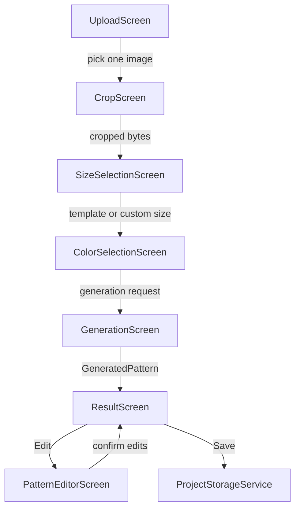
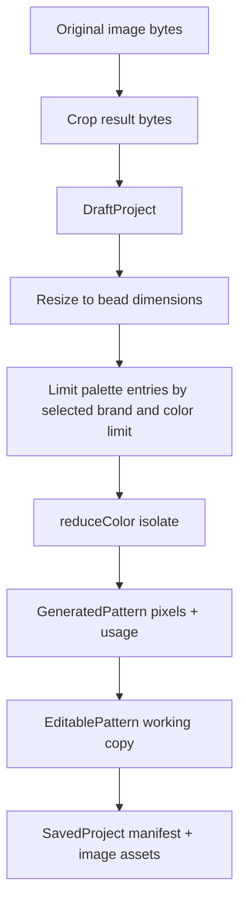
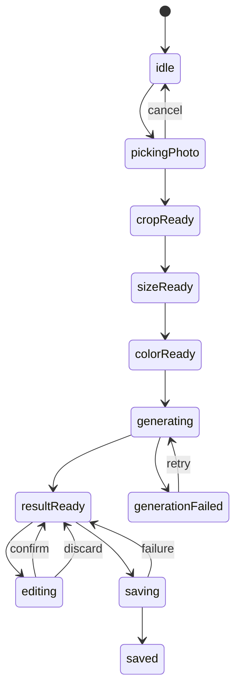

# feat: Build Pin MVP Client Flow

## Summary

Build the first usable Pin client flow on top of the current Flutter bead-pattern prototype. The MVP turns one selected photo into a cropped, template-sized bead pattern, lets the user choose color constraints, shows a material list, supports light pixel-level editing, and saves the project locally.

The plan keeps the existing image processing, palette, matching, and painter code, but replaces the single prototype screen with a product flow that matches the supplied Figma direction.

---

## Problem Frame

The current app is a useful prototype: it can pick an image, convert it to a bead pattern, render a preview, count bead usage, and export a PNG. It is not yet a client product. All major controls live on one technical screen, sizing is expressed in board math, palette selection allows multiple brands, there is no crop flow, no product template abstraction, no local project save, and no editing flow.

The first client version needs to hide technical bead-generation details behind a craft-oriented flow:

```text
Upload photo
  -> Crop photo
  -> Choose product template
  -> Choose color settings
  -> Generate pattern
  -> Result + material list
  -> Light edit
  -> Save local project
```

---

## Requirements

**Photo intake and crop**

- R1. The app opens the system photo picker when the user taps "Upload Photo" and accepts only one image.
- R2. The app navigates to crop after successful image selection and stays put when the picker is cancelled.
- R3. The crop screen supports 9:16, 3:4, 1:1, 4:3, 16:9, and freeform crop.
- R4. The crop screen outputs cropped image bytes that become the only input for downstream generation.

**Template sizing**

- R5. The size page presents product/use-case templates rather than raw board counts.
- R6. Each template maps to internal bead width, bead height, physical size text, default aspect ratio, and estimated bead count.
- R7. The custom template accepts explicit bead width and height within app-defined bounds.
- R8. Invalid custom dimensions block continuation and explain the limit.

**Color setup and generation**

- R9. The color page lets the user choose exactly one bead color brand for generation.
- R10. The color page offers discrete color limits: unlimited, 8, 16, 24, and 32.
- R11. The color smoothing toggle maps to the existing dithering behavior.
- R12. Generation runs off the UI thread where Flutter supports isolates and prevents duplicate generation taps.
- R13. Generation failure shows a retry path without losing the selected photo, crop, template, or color settings.

**Result and material list**

- R14. The result page shows the generated bead pattern preview and total bead count.
- R15. The material list shows color swatch, color code, color name, and required quantity, sorted by quantity descending.
- R16. Tapping a material color opens replace-color behavior.
- R17. Long-pressing a material color offers delete/remove behavior and asks for confirmation when the affected color is more than 5% of all beads.
- R18. Replace and delete actions recalculate pattern pixels and material usage.

**Light editing**

- R19. The result page can open a light editor.
- R20. The editor supports picker, current color, brush, eraser, brush size, undo, redo, confirm, and discard.
- R21. Confirming edits updates the result pattern and material usage.
- R22. Discarding edits returns to the result without changing the pattern.

**Persistence**

- R23. Saving stores the project locally in the app, including enough data to reopen the result later.
- R24. Save failure keeps the result visible and offers retry.

---

## High-Level Technical Design

### Client Flow



### Data Pipeline



### State Model



---

## Key Technical Decisions

- **Use a route-per-step flow instead of one giant form:** The existing `HomeScreen` mixes image selection, size, algorithm, dithering, palette selection, and generation. The MVP should split that into screens so navigation state matches the product flow and each page can be tested independently.
- **Introduce product templates as domain data:** `BoardType` and `boardsX/boardsY` are too technical for the new UX. Add `ProductTemplate` and map each template to bead dimensions internally.
- **Use one selected palette brand in MVP:** The current prototype supports selecting multiple palettes. The requirements call for one brand, which keeps material lists, replacement, and purchase-oriented future flows coherent.
- **Represent color count as a palette constraint before generation:** The existing reducer matches against every enabled palette entry. Add a pre-generation palette limiting step so `8/16/24/32` constraints are deterministic and testable.
- **Map "color smoothing" to dithering:** The current reducer already supports Floyd-Steinberg dithering and hardness. MVP should expose this as a simple on/off setting, using a fixed internal hardness unless the product later needs an advanced control.
- **Use `crop_your_image` for crop UI:** It is a Flutter widget and can match the Figma crop screen. Avoid `image_cropper` for MVP because native cropper UI will diverge across iOS and Android.
- **Save locally with app-managed files before adding a database:** Use `path_provider`, `dart:io`, and JSON serialization for `SavedProject`. This is enough for MVP and avoids adding persistence complexity before the data model settles.
- **Treat light editor operations as pixel mutations with undo commands:** Keep the editor at bead-cell level. Store undo/redo as compact edit operations rather than full project objects, but allow snapshots if implementation shows command tracking is riskier.
- **Keep PNG export secondary:** Existing export code can be reused later. MVP "Save" means local project save; share/export should not block the first client flow.

---

## Scope Boundaries

### In Scope

- Upload one image from the system photo picker.
- Crop selected image using fixed ratios or freeform crop.
- Choose product/use-case template or custom bead dimensions.
- Choose one color brand and a color limit.
- Generate bead pattern and material usage list.
- Replace/delete colors from the material list.
- Light pixel-level editing.
- Save project locally.
- Unit and widget tests for all feature-bearing logic.

### Deferred to Follow-Up Work

- Project gallery/home for reopening many saved projects. MVP persistence should support it, but the gallery can be basic or deferred if time is tight.
- PNG export from the result page. Existing code already has the core painter/export approach, but save-to-project is the MVP requirement.
- PDF split-board printing.
- Local palette caching beyond in-memory cache and fallback palette.
- Manual color enable/disable before generation.
- Full editor tools such as fill bucket, lasso, magic wand, layers, selections, and region transforms.

### Outside MVP Identity

- Login, accounts, and cloud sync.
- Social/community content.
- Marketplace or purchase flow.
- Multi-image batch generation.
- Multi-brand mixed-material generation.

---

## Implementation Units

### U1. Add MVP Domain Models

- **Goal:** Add domain models that represent the Pin flow independently from the old board-based `Project`.
- **Requirements:** R5, R6, R7, R8, R9, R10, R23.
- **Dependencies:** None.
- **Files:**
  - `lib/models/product_template.dart`
  - `lib/models/draft_project.dart`
  - `lib/models/generated_pattern.dart`
  - `lib/models/editable_pattern.dart`
  - `lib/models/saved_project.dart`
  - `lib/models/project.dart`
  - `test/models/product_template_test.dart`
  - `test/models/draft_project_test.dart`
- **Approach:**
  - Keep `Project` available for compatibility with `BeadPainter` while introducing the MVP models.
  - Add `ProductTemplate` with stable `id`, `name`, `subtitle`, `physicalSizeCm`, `beadWidth`, `beadHeight`, `defaultAspectRatio`, and `estimatedBeads`.
  - Add a template catalog with the eight requirement templates: small charm, fridge magnet, keychain, large keychain, coaster, decorative picture, luggage tag, and custom.
  - Use placeholder bead dimensions in constants, with a clear comment that product/business must finalize exact values. The plan should not block implementation on exact commercial dimensions.
  - Add custom dimension validation with initial bounds of 8 to 128 beads per side. The upper bound protects UI memory and generation time; it can change after profiling.
  - Add `DraftProject` for photo/crop/template/color settings before generation.
  - Add `GeneratedPattern` as a wrapper around `ColorReducerResult` plus selected template, palette metadata, and total bead count.
  - Add `EditablePattern` for mutable editor state.
  - Add `SavedProject` for persisted local data and JSON serialization.
- **Patterns to follow:**
  - Existing plain Dart model style in `lib/models/project.dart`.
  - Existing palette model style in `lib/models/palette.dart`.
- **Test scenarios:**
  - `ProductTemplate.catalog` contains all MVP templates with unique ids.
  - Each non-custom template exposes positive bead width, height, physical size, and estimate.
  - Custom dimensions at min and max pass validation.
  - Custom dimensions below min, above max, zero, and negative values fail validation.
  - `DraftProject` reports readiness only after crop bytes, template, palette brand, and color limit are present.
  - `SavedProject` serializes and deserializes metadata without losing ids, timestamps, template, palette brand, or pattern dimensions.
- **Verification:** A developer can create a draft from selected crop bytes, choose a template, and know the output bead dimensions without using `BoardType`.

### U2. Add App Flow State and Navigation Shell

- **Goal:** Replace the prototype's single-screen flow with route-level MVP screens that pass a draft project forward.
- **Requirements:** R1, R2, R4, R5, R9, R12, R14, R19, R23.
- **Dependencies:** U1.
- **Files:**
  - `lib/main.dart`
  - `lib/screens/upload_screen.dart`
  - `lib/screens/crop_screen.dart`
  - `lib/screens/size_selection_screen.dart`
  - `lib/screens/color_selection_screen.dart`
  - `lib/screens/generation_screen.dart`
  - `lib/screens/result_screen.dart`
  - `lib/screens/pattern_editor_screen.dart`
  - `lib/screens/home_screen.dart`
  - `test/widget/app_flow_test.dart`
- **Approach:**
  - Make `UploadScreen` the app home for MVP. Keep `HomeScreen` as a reference or remove it after replacement.
  - Use explicit `Navigator.push` route handoff for MVP rather than adding a routing package. This keeps dependencies small and matches the current app.
  - Pass immutable-ish data forward: source image bytes to crop, cropped bytes to size selection, `DraftProject` to color selection and generation, `GeneratedPattern` to result and editor.
  - Add clear back behavior: back from crop returns to upload; back from size returns to crop; back from color returns to size; generation should either block back with cancellation confirmation or ignore stale results.
  - Do not introduce global app state unless implementation shows route argument passing becomes brittle.
- **Patterns to follow:**
  - Existing `Navigator.push` usage in `lib/screens/home_screen.dart`.
  - Existing Material app setup in `lib/main.dart`.
- **Test scenarios:**
  - App starts on upload screen and shows the upload CTA.
  - Upload cancel keeps the upload screen visible.
  - A simulated selected image routes to crop.
  - Crop confirmation routes to size selection with crop bytes.
  - Size selection routes to color selection only when a template is selected.
  - Color selection routes to generation only when palette brand and color limit are selected.
  - Result edit button routes to editor and returns updated pattern on confirm.
- **Verification:** A developer can walk the app through all routes with fake image bytes in widget tests without invoking the real image picker.

### U3. Implement Photo Selection and Crop

- **Goal:** Add photo selection and crop preprocessing that produces the image bytes used for generation.
- **Requirements:** R1, R2, R3, R4.
- **Dependencies:** U1, U2.
- **Files:**
  - `pubspec.yaml`
  - `lib/services/image_service.dart`
  - `lib/services/crop_service.dart`
  - `lib/screens/upload_screen.dart`
  - `lib/screens/crop_screen.dart`
  - `test/services/image_service_test.dart`
  - `test/services/crop_service_test.dart`
  - `test/widget/crop_screen_test.dart`
- **Approach:**
  - Add `crop_your_image` to `pubspec.yaml`.
  - Keep `ImageService.pickImage` but expose an injectable picker path for tests.
  - Add `CropScreen` with preset ratio controls for 9:16, 3:4, 1:1, 4:3, 16:9, plus freeform.
  - Add `CropService` only for non-widget crop-related helpers such as ratio modeling, crop result validation, and byte sanity checks.
  - Store the last selected ratio in memory for MVP. Persisting it can wait until local settings exist.
  - Treat camera capture as out of scope for MVP because the requirement says upload photo from album.
  - Convert crop failures into user-visible retry states rather than exceptions bubbling to the screen.
- **Patterns to follow:**
  - Existing image byte reading in `ImageService.pickImage`.
  - Existing use of `package:image` for decode and resizing.
- **Test scenarios:**
  - Picker returns null: upload screen stays in idle state.
  - Picker returns image: upload screen navigates to crop with bytes.
  - Permission or platform exception: upload screen shows recoverable error.
  - Each fixed crop ratio maps to the expected numeric ratio.
  - Freeform mode does not force a fixed ratio.
  - Empty or invalid crop bytes are rejected before size selection.
  - Crop confirm button disables while crop is in progress.
- **Verification:** A cropped image byte array is the only image input carried into size selection and generation.

### U4. Implement Product Template Size Selection

- **Goal:** Build the Figma-inspired size selection page using product templates instead of board controls.
- **Requirements:** R5, R6, R7, R8.
- **Dependencies:** U1, U2, U3.
- **Files:**
  - `lib/screens/size_selection_screen.dart`
  - `lib/widgets/product_template_card.dart`
  - `lib/widgets/cropped_image_preview.dart`
  - `lib/models/product_template.dart`
  - `test/widget/size_selection_screen_test.dart`
  - `test/widgets/product_template_card_test.dart`
- **Approach:**
  - Render the cropped photo preview at the top.
  - Render template cards in a grid matching the visual direction: large number or label, name, physical size.
  - Internally, use template ids and bead dimensions from `ProductTemplate`.
  - Show estimated bead count from `beadWidth * beadHeight`, optionally adjusted later if transparent crop areas become possible.
  - Show custom width/height controls only when custom is selected.
  - Disable "Choose Colors" until a valid template or custom size is selected.
  - Keep exact typography/colors aligned with design implementation later; this unit should prioritize behavior and layout structure.
- **Patterns to follow:**
  - Existing `Card` and form controls from `HomeScreen`, but extract widgets to avoid repeating card selection logic.
- **Test scenarios:**
  - Default selected template is deterministic.
  - Tapping a template updates selected id, bead dimensions, and estimated count.
  - Custom selected with blank values disables the CTA.
  - Custom selected with valid values enables the CTA.
  - Custom selected with values outside bounds shows validation text.
  - Continuing creates or updates `DraftProject` with selected template and bead dimensions.
- **Verification:** The next screen receives a draft whose target width and height do not depend on `BoardType`.

### U5. Implement Color Selection and Palette Constraints

- **Goal:** Build the color settings page and make generation respect one brand plus a color-count limit.
- **Requirements:** R9, R10, R11, R12, R13.
- **Dependencies:** U1, U2, U4.
- **Files:**
  - `lib/screens/color_selection_screen.dart`
  - `lib/services/palette_service.dart`
  - `lib/services/palette_constraint_service.dart`
  - `lib/models/palette.dart`
  - `test/services/palette_constraint_service_test.dart`
  - `test/widget/color_selection_screen_test.dart`
- **Approach:**
  - Display one-brand selection from `PaletteService.availablePalettes`.
  - Store `paletteBrandId` in `DraftProject`, not a list of palette indices.
  - Add a `ColorLimit` enum or value object for unlimited, 8, 16, 24, and 32.
  - Implement `PaletteConstraintService` that receives a `Palette` and `ColorLimit`, and returns a palette for generation.
  - For MVP, when a finite color limit is chosen, choose the first N enabled entries after palette load. If product quality requires smarter color reduction, add it as a later improvement. This is simple but may not choose optimal colors for every photo.
  - Map smoothing on/off to `ditheringEnabled`. Use a fixed `ditheringHardness`, likely 50, unless design adds a hidden setting.
  - If selected palette fails to load, show a recoverable error or fallback to B&W only when the user explicitly retries with fallback. Do not silently generate black-white output when the user selected a brand.
  - Prevent duplicate "Generate Pattern" taps with a local `isSubmitting` state.
- **Patterns to follow:**
  - Existing `PaletteService.loadByName`.
  - Existing `MatchingAlgorithm.cie2000` default in `Project`.
- **Test scenarios:**
  - Brand list renders from palette definitions.
  - Selecting a brand updates the draft.
  - Unlimited color limit returns all enabled entries.
  - 8/16/24/32 limits return at most that many enabled entries.
  - A palette with fewer colors than the limit returns all available entries.
  - Smoothing on maps to dithering enabled.
  - Generate button is disabled while submission is in progress.
  - Palette load failure shows retry and does not navigate to generation.
- **Verification:** The generation screen receives one constrained palette and generation settings derived from UI choices.

### U6. Implement Generation Orchestration

- **Goal:** Convert the cropped image and selected settings into a `GeneratedPattern` with accurate usage.
- **Requirements:** R12, R13, R14, R15.
- **Dependencies:** U1, U3, U5.
- **Files:**
  - `lib/services/pattern_generation_service.dart`
  - `lib/algorithms/color_reducer.dart`
  - `lib/services/image_service.dart`
  - `lib/screens/generation_screen.dart`
  - `test/services/pattern_generation_service_test.dart`
  - `test/algorithms/color_reducer_test.dart`
  - `test/widget/generation_screen_test.dart`
- **Approach:**
  - Move the `_ReduceColorParams` and isolate wrapper currently embedded in `HomeScreen` into `PatternGenerationService`.
  - Keep `reduceColor` as the pure algorithm entry point.
  - Use `ImageService.resizeAndGetPixels` with selected template bead width and height.
  - Use `ImagePosition(0, 0, width, height)` after crop because crop bytes should already represent the desired composition.
  - Use `MatchingAlgorithm.cie2000` by default unless a hidden debug setting is needed.
  - On non-web platforms, use `compute`; on web, use direct call as the current code does.
  - Add stale-result protection: when a generation request starts, store a request token in screen state and ignore the result if the screen was disposed or the token changed.
  - Convert thrown exceptions into a generation failure UI with retry.
- **Patterns to follow:**
  - Existing `_beadify` flow in `HomeScreen`.
  - Existing `kIsWeb` branch for isolate compatibility.
- **Test scenarios:**
  - Generation returns a pattern whose width and height match the selected template.
  - Generation uses cropped bytes rather than original bytes.
  - Generation with B&W test palette counts expected black/white usage for a small fixture image.
  - Generation failure from image decode surfaces as failure state.
  - Duplicate request does not trigger two navigations.
  - Stale completed request does not update disposed screen state.
  - Empty constrained palette is rejected before calling `reduceColor`.
- **Verification:** Generation no longer depends on `HomeScreen` state and can be tested as a service.

### U7. Implement Result Screen and Material Actions

- **Goal:** Build the result page with pattern preview, material list, replace color, delete color, edit, and save entry points.
- **Requirements:** R14, R15, R16, R17, R18, R19, R23, R24.
- **Dependencies:** U1, U6.
- **Files:**
  - `lib/screens/result_screen.dart`
  - `lib/widgets/pattern_preview.dart`
  - `lib/widgets/material_usage_list.dart`
  - `lib/services/material_edit_service.dart`
  - `lib/rendering/bead_painter.dart`
  - `test/services/material_edit_service_test.dart`
  - `test/widget/result_screen_test.dart`
  - `test/widgets/material_usage_list_test.dart`
- **Approach:**
  - Extract reusable pattern preview around `BeadPainter` and `InteractiveViewer`.
  - Keep sorted usage display: quantity descending.
  - Create `MaterialUsageList` rows/chips with swatch, code, name, and quantity.
  - Add `MaterialEditService.replaceColor` to change all pixels of one palette entry to another and recompute usage.
  - Add `MaterialEditService.deleteColor` to clear matching pixels to transparent and recompute usage.
  - Confirm delete when the color count is more than 5% of total beads. For smaller colors, allow direct delete with an undo-friendly snackbar only if implementation already supports result-level undo; otherwise confirm all deletes.
  - Make save button call `ProjectStorageService` from U9.
  - Keep PNG share/export out of this screen unless save is already complete and the UI has room for a secondary action.
- **Patterns to follow:**
  - Existing usage bar logic in `PreviewScreen`.
  - Existing inventory list logic in `ExportScreen`.
  - Existing `BeadPainter` rendering.
- **Test scenarios:**
  - Result page shows pattern preview, total count, and sorted usage rows.
  - Material row displays swatch, ref/code, name, and quantity.
  - Replace color changes all matching pixels and recomputes usage.
  - Delete color clears matching pixels and recomputes usage.
  - Delete confirmation appears for colors above 5% of total count.
  - Edit button opens editor with current pattern.
  - Save button shows progress, success, and failure states.
- **Verification:** A generated pattern can be corrected from the material list without regenerating from the original image.

### U8. Implement Light Pattern Editor

- **Goal:** Add bead-cell-level editing with picker, brush, eraser, brush size, undo, redo, confirm, and discard.
- **Requirements:** R19, R20, R21, R22.
- **Dependencies:** U1, U7.
- **Files:**
  - `lib/screens/pattern_editor_screen.dart`
  - `lib/widgets/editable_bead_canvas.dart`
  - `lib/widgets/editor_toolbar.dart`
  - `lib/services/editor_history_service.dart`
  - `lib/services/pattern_edit_service.dart`
  - `test/services/editor_history_service_test.dart`
  - `test/services/pattern_edit_service_test.dart`
  - `test/widget/pattern_editor_screen_test.dart`
  - `test/widgets/editable_bead_canvas_test.dart`
- **Approach:**
  - Use an `EditablePattern` working copy initialized from `GeneratedPattern.pixels`.
  - Convert tap/drag positions to bead coordinates using canvas dimensions and rendered bead size.
  - Tools:
    - picker: set selected color from tapped bead.
    - brush: apply selected palette color to touched bead cells.
    - eraser: set touched bead alpha to 0.
  - Brush sizes 1 to 5 mean square or circular bead-cell radius. Use one shape consistently and document it in code.
  - Record edit operations in `EditorHistoryService`. A single drag gesture should become one undo item containing all changed cells.
  - Disable undo/redo buttons when stacks are empty.
  - Confirm returns edited pixels and recomputed usage to result.
  - Discard returns null or original pattern unchanged.
  - Prevent confirming an empty pattern unless the user explicitly discards.
- **Patterns to follow:**
  - Existing `BeadPainter` coordinate assumptions.
  - Existing `computeUsage` for usage recalculation.
- **Test scenarios:**
  - Tapping a cell with brush changes exactly that cell for brush size 1.
  - Brush size greater than 1 changes the expected neighborhood and stays inside bounds.
  - Eraser makes target cells transparent.
  - Picker updates selected color from the tapped bead.
  - One drag gesture creates one undo step.
  - Undo restores previous pixels and enables redo.
  - Redo reapplies pixels and enables undo.
  - Confirm returns changed pixels and recomputed usage.
  - Discard returns without changing original result.
  - Attempts to edit outside canvas bounds do nothing and do not throw.
- **Verification:** The editor can fix a generated pattern and return a changed material list without rerunning image generation.

### U9. Implement Local Project Save

- **Goal:** Persist saved projects locally using app-managed files.
- **Requirements:** R23, R24.
- **Dependencies:** U1, U6, U7, U8.
- **Files:**
  - `lib/services/project_storage_service.dart`
  - `lib/services/project_thumbnail_service.dart`
  - `lib/models/saved_project.dart`
  - `lib/screens/result_screen.dart`
  - `test/services/project_storage_service_test.dart`
  - `test/services/project_thumbnail_service_test.dart`
- **Approach:**
  - Use `path_provider` to locate the app documents directory.
  - Store each project under `projects/<project-id>/`.
  - Store a `project.json` manifest with metadata and lightweight settings.
  - Store generated pattern pixels as binary or PNG. Pick the simpler representation during implementation, but preserve exact pattern pixels for reopening/editing.
  - Store a thumbnail PNG for future gallery use.
  - Use ISO timestamps for `createdAt` and `updatedAt`.
  - Make write atomic enough for MVP: write to temp file, then rename to final manifest where possible.
  - On save failure, return a typed error/result so the result screen can show retry.
- **Patterns to follow:**
  - Existing `path_provider` usage in `ExportScreen`.
  - Existing PNG rendering approach in `ExportScreen` for thumbnails.
- **Test scenarios:**
  - Saving a project creates project directory, manifest, pattern asset, and thumbnail.
  - Loading saved manifest reconstructs `SavedProject` metadata.
  - Save failure returns failure without clearing result screen state.
  - Duplicate save updates `updatedAt` and does not create a second id unless user intentionally saves as new.
  - Corrupt manifest returns a recoverable load error.
- **Verification:** After tapping save, project data exists in app storage and can be loaded by a service test without UI.

### U10. Add MVP Visual Components and Design Alignment

- **Goal:** Translate the Figma visual direction into reusable Flutter widgets without coupling style to business logic.
- **Requirements:** Supports all screen-level requirements.
- **Dependencies:** U2, U4, U5, U7, U8.
- **Files:**
  - `lib/theme/app_theme.dart`
  - `lib/widgets/pin_primary_button.dart`
  - `lib/widgets/pin_bottom_panel.dart`
  - `lib/widgets/pin_toggle.dart`
  - `lib/widgets/pin_segmented_options.dart`
  - `lib/widgets/product_template_card.dart`
  - `lib/widgets/material_usage_chip.dart`
  - `lib/main.dart`
  - `test/widgets/pin_primary_button_test.dart`
  - `test/widgets/pin_segmented_options_test.dart`
- **Approach:**
  - Add a light theme close to the Figma direction: pale app background, white rounded bottom panels, black primary CTA, pink accent for toggles/sliders.
  - Keep visual widgets reusable and dumb. They should receive selected state, labels, and callbacks, not own project state.
  - Use consistent bottom CTA layout for size, color, result, and editor confirmation.
  - Use fixed button heights and responsive widths so text does not overflow in Chinese.
  - Keep Material components where they work, but wrap them to match product styling.
- **Patterns to follow:**
  - Current Material 3 setup in `main.dart`.
  - Figma screenshots supplied in the planning conversation.
- **Test scenarios:**
  - Primary button disabled state blocks taps.
  - Segmented option widget reports selected value.
  - Template card shows selected and unselected state.
  - Long Chinese labels do not overflow in common mobile-width widget tests.
- **Verification:** Screens use shared style primitives rather than each page hand-rolling button, panel, and option styling.

### U11. Add Test Coverage and Developer Fixtures

- **Goal:** Make the MVP safe to develop by adding fixtures and coverage around the algorithm, flow, editor, persistence, and failure states.
- **Requirements:** Covers R1 through R24.
- **Dependencies:** U1 through U10.
- **Files:**
  - `test/fixtures/`
  - `test/helpers/test_palettes.dart`
  - `test/helpers/test_images.dart`
  - `test/algorithms/color_reducer_test.dart`
  - `test/services/pattern_generation_service_test.dart`
  - `test/services/material_edit_service_test.dart`
  - `test/services/pattern_edit_service_test.dart`
  - `test/services/project_storage_service_test.dart`
  - `test/widget/app_flow_test.dart`
  - `test/widget/result_screen_test.dart`
  - `test/widget/pattern_editor_screen_test.dart`
- **Approach:**
  - Add tiny synthetic images rather than large binary fixtures where possible.
  - Add deterministic test palettes: B&W, RGB primary, and a small named brand-like palette.
  - Favor service tests for algorithms and persistence; widget tests for navigation and visible states.
  - Keep real platform image picker out of widget tests by injecting fake selection behavior.
  - Add at least one full flow widget test using fake services: upload selected image -> crop confirmed -> template selected -> colors selected -> generated result -> save.
  - Track the current Flutter environment issue separately: local `flutter test` previously failed because the Flutter SDK cache was missing `flutter_tester` and could not fetch from GitHub. Implementation should verify after SDK cache is healthy.
- **Patterns to follow:**
  - Existing smoke test in `test/widget_test.dart`, but replace it with behavior-focused tests as screens change.
- **Test scenarios:**
  - Every implementation unit above has its listed tests.
  - The full happy path works with fake services.
  - Permission denied, picker cancelled, crop failed, palette failed, generation failed, save failed all produce visible recovery UI.
  - Editor update changes usage and undo/redo restores usage.
- **Verification:** The test suite proves both pure logic and user-visible error handling, not just app startup.

---

## Output Structure

Expected shape after implementation:

```text
lib/
  algorithms/
    color_reducer.dart
    matching.dart
  models/
    color.dart
    draft_project.dart
    editable_pattern.dart
    generated_pattern.dart
    palette.dart
    product_template.dart
    project.dart
    saved_project.dart
  rendering/
    bead_painter.dart
  screens/
    upload_screen.dart
    crop_screen.dart
    size_selection_screen.dart
    color_selection_screen.dart
    generation_screen.dart
    result_screen.dart
    pattern_editor_screen.dart
  services/
    crop_service.dart
    editor_history_service.dart
    image_service.dart
    material_edit_service.dart
    palette_constraint_service.dart
    palette_service.dart
    pattern_edit_service.dart
    pattern_generation_service.dart
    project_storage_service.dart
    project_thumbnail_service.dart
  theme/
    app_theme.dart
  widgets/
    cropped_image_preview.dart
    editable_bead_canvas.dart
    editor_toolbar.dart
    material_usage_chip.dart
    material_usage_list.dart
    pattern_preview.dart
    pin_bottom_panel.dart
    pin_primary_button.dart
    pin_segmented_options.dart
    pin_toggle.dart
    product_template_card.dart
test/
  algorithms/
  fixtures/
  helpers/
  models/
  services/
  widget/
  widgets/
```

This tree is a planning target. If implementation reveals a cleaner grouping, preserve the same boundaries: models stay pure, services own transformations/IO, screens own route state, widgets stay reusable.

---

## Acceptance Examples

- AE1. Given the user taps upload and cancels the picker, when the picker closes, then the upload screen remains visible and no draft project is created.
- AE2. Given the user selects one photo, when the bytes are read successfully, then the crop screen opens with the selected image.
- AE3. Given the user crops at 1:1 and selects the keychain template, when they continue, then color selection receives cropped bytes and the keychain bead dimensions.
- AE4. Given the user selects MARD and 16 colors, when they generate, then the generation service constrains the selected palette and produces a pattern at the selected template dimensions.
- AE5. Given generation fails, when the failure state renders, then the user can retry without re-uploading or re-cropping the photo.
- AE6. Given a generated result, when the result page opens, then the pattern, total bead count, and sorted material list are visible.
- AE7. Given a color represents more than 5% of total beads, when the user long-presses it, then the app asks for confirmation before deletion.
- AE8. Given the user edits one bead color and taps OK, when the result page returns, then the material usage reflects the changed pixels.
- AE9. Given the user saves a result, when the save completes, then a local project manifest and pattern asset exist in app storage.

---

## Risks & Dependencies

- **Template dimensions are not finalized:** Implement with constants and comments so product can tune values without changing flow code.
- **Palette color limits may be visually naive:** Taking the first N palette entries is deterministic but not image-aware. If output quality is poor, add a later palette preselection algorithm based on image colors.
- **Crop package integration may need platform tuning:** `crop_your_image` should fit the embedded UI need, but implementation must verify iOS and Android gestures.
- **Large custom sizes can freeze or exhaust memory:** Enforce conservative custom bounds until performance profiling justifies higher limits.
- **Editor gesture history can grow memory quickly:** Group drag strokes into one undo item and cap undo stack size.
- **Remote palette service can fail:** MVP should show recoverable errors for selected brands and avoid silently producing unexpected B&W output.
- **Local Flutter SDK is currently unhealthy in this environment:** Earlier `flutter test` could not find `flutter_tester` and could not fetch from GitHub. Developers need a healthy Flutter SDK cache before validating the plan.

---

## Documentation / Operational Notes

- Update `README.md` after implementation to describe the new MVP flow instead of the original prototype-only flow.
- Add comments around the generation pipeline and editor history model. These two areas are easiest to break later.
- Keep design constants centralized in `lib/theme/app_theme.dart` and reusable widgets so Figma refinements do not require editing every screen.
- Avoid storing user photos outside app-managed directories.

---

## Sources & Research

- Origin requirements: `docs/requirements/pin-mvp-requirements.md`.
- Existing generation prototype: `lib/screens/home_screen.dart`.
- Existing algorithm pipeline: `lib/algorithms/color_reducer.dart`, `lib/algorithms/matching.dart`.
- Existing painter: `lib/rendering/bead_painter.dart`.
- Existing palette loading: `lib/services/palette_service.dart`.
- Existing export/storage pattern: `lib/screens/export_screen.dart`.
- Crop package candidate: `crop_your_image` on pub.dev, chosen because it supports an embedded Flutter crop UI suitable for the Figma flow.
- Native crop package considered: `image_cropper` on pub.dev, deferred because native UI would diverge from the designed crop page.

---

## Implementation Order

1. U1. Add MVP Domain Models.
2. U2. Add App Flow State and Navigation Shell.
3. U3. Implement Photo Selection and Crop.
4. U4. Implement Product Template Size Selection.
5. U5. Implement Color Selection and Palette Constraints.
6. U6. Implement Generation Orchestration.
7. U7. Implement Result Screen and Material Actions.
8. U8. Implement Light Pattern Editor.
9. U9. Implement Local Project Save.
10. U10. Add MVP Visual Components and Design Alignment.
11. U11. Add Test Coverage and Developer Fixtures.

Recommended milestone split:

- **M1:** U1 through U7 plus the relevant U10 widgets and U11 tests. This ships upload, crop, size, color, generation, result, material list, and save entry scaffolding.
- **M2:** U8, U9 finalization, remaining U10 polish, and full U11 coverage. This ships light editing and reliable local persistence.

---

## Parallelization Strategy

| Lane | Units | Notes |
| --- | --- | --- |
| A | U1 -> U6 | Core models and generation pipeline. Must land before most UI can be fully wired. |
| B | U10 | Visual primitives can start after U2 route names are known, but should avoid owning state. |
| C | U11 fixtures | Test fixtures and helper palettes can begin after U1 model shapes are stable. |
| D | U8 | Editor should wait for U7 result shape and pattern model. |
| E | U9 | Storage can start after U1 models, but final save wiring waits for U7/U8. |

Do not split U2, U3, U4, and U5 across parallel worktrees unless the team agrees on route argument shapes first. Those units touch the same screen-flow boundary and will otherwise create avoidable merge conflicts.

---

## Open Questions

- Exact bead dimensions and physical sizes for each product template remain a product decision.
- The default Chinese-market palette brand needs confirmation. Use the first available supported brand until product chooses one.
- "Unlimited colors" may overwhelm craft users. Keep it available if design wants it, but default to 16 colors.
- Result-level color replacement UI details are not present in the screenshots. Implement a simple picker/list first and let design refine.
- Whether save should immediately also export to the system album remains out of MVP unless product changes the meaning of save.
