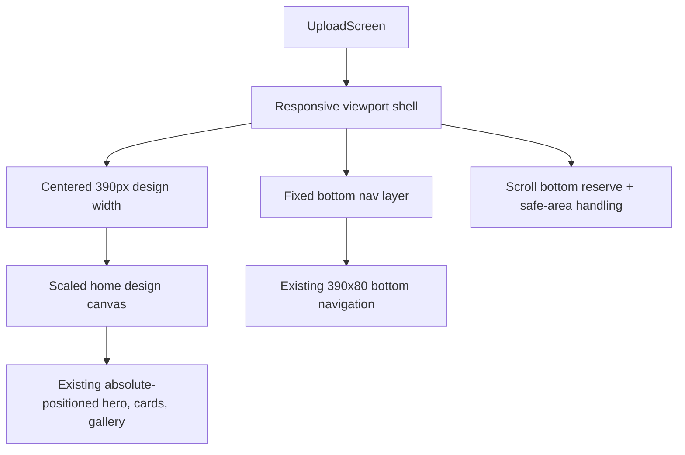

# refactor: Preserve Home Layout While Adding Screen Adaptation

## Summary

This plan keeps the current home page's visual composition, component positions, and 390px Figma-coordinate layout as the source of truth, while making the outer Flutter layout behave correctly across small and large iPhone screens. The implementation should not redesign the home page; it should preserve the current look and add a safer responsive shell, bottom navigation reserve, safe-area handling, and viewport tests.

---

## Problem Frame

The current `UploadScreen` is visually close to the approved homepage: the hero card, two feature cards, gallery header, gallery grid, custom icons, and bottom navigation are all positioned in a 390px-wide design coordinate system. That is the right baseline and should remain the primary layout model.

The remaining problem is not that the design needs a new responsive layout. The problem is that the whole page is currently rendered as one scaled absolute canvas with a fixed bottom navigation overlay. On shorter screens such as iPhone SE 3, less content is naturally visible above the fold, and the fixed bottom navigation can cover the scrollable content unless the scroll area reserves space for it. On taller screens such as newer large iPhones, more content is visible above the fold. That height difference is expected; the goal is experience consistency, not making every phone show the exact same first viewport.

This plan therefore uses a conservative adaptation strategy: keep the current 390px visual coordinates and only change the layout shell around them.

---

## Requirements

**Visual preservation**

- R1. The home page must keep the current visual hierarchy, relative positions, component sizes, colors, artwork, and painter-based icons unless a change is required to prevent layout breakage.
- R2. The 390px Figma design coordinate system must remain the source of truth for the approved homepage composition.
- R3. Wider phones must not stretch the artwork beyond the approved design width; the page should stay centered and visually consistent with the current iPhone 17 result.
- R4. Narrower phones may scale the 390px design down by width, but the relative positions inside the design must remain unchanged.

**Viewport behavior**

- R5. Different phone heights may show different amounts of content above the fold; the app must rely on vertical scrolling for the rest of the page.
- R6. The bottom navigation must remain fixed at the bottom while the scrollable content reserves enough bottom space so gallery content is not permanently hidden behind it.
- R7. Devices with a bottom home-indicator safe area must get a white safe-area extension without moving the internal bottom-navigation labels out of their current visual relationship.
- R8. The app must not reintroduce a fake status bar; top time, carrier, battery, and native system indicators are controlled by iOS, not by this page's Flutter widgets.

**Gallery and backend readiness**

- R9. Gallery thumbnails must continue to accept future backend-provided 1:1 square image URLs.
- R10. Gallery thumbnails must keep centered `BoxFit.cover` behavior so square backend thumbnails fill the tile without distortion.

**Quality gates**

- R11. The adapted home page must render without Flutter overflow exceptions on representative small, standard, and large iPhone viewport sizes.
- R12. The page must keep the bottom navigation visible and tappable at all tested viewport sizes.
- R13. The scrollable gallery area must remain reachable on short screens after accounting for the fixed bottom navigation.

---

## High-Level Technical Design

The design keeps the existing 390px canvas. The refactor introduces a clearer separation between the approved design surface and the viewport shell that hosts it.



The layout math should remain intentionally simple:

```text
pageWidth = min(viewportWidth, 390)
scale = pageWidth / 390
scaledDesignHeight = 1162 * scale
bottomNavDesignHeight = 80 * scale
bottomSafeArea = MediaQuery.padding.bottom
bottomNavTotalHeight = bottomNavDesignHeight + bottomSafeArea
scrollBottomReserve = bottomNavTotalHeight + smallVisualGap
scrollContentHeight = max(
  scaledDesignHeight + scrollBottomReserve,
  viewportHeight + scrollBottomReserve
)
```

This preserves the current width behavior:

| Viewport | Width strategy | Height strategy | Expected result |
|---|---:|---|---|
| iPhone SE 3, 375px wide | Scale 390 design down to 375 | Scroll shows less above fold | Same composition, smaller and scrollable |
| iPhone 12, 390px wide | Scale is 1.0 | Scroll shows standard amount | Matches the design baseline |
| Large iPhone, wider than 390px | Cap page at 390 and center | Taller viewport shows more content | Looks like the current large-phone version without stretching |

### Component Preservation Map

| Component | Current implementation | Preservation rule |
|---|---|---|
| Header background | `home_header.png` at `left: 0`, `top: 0`, `width: 390`, `height: 480` | Keep exact design-canvas position and size. |
| Hero card | `_HeroCard` positioned at `left: 12`, `top: 154`, `width: 366`, `height: 197` | Keep exact outer and inner coordinates. |
| Hero decorative rings and hangers | `_LightPinkRing`, yellow ring, pink ring, `_PinkHangerDeco`, `_LeftHangerDeco` | Keep same layer order and coordinates. |
| Feature cards | `_FeatureCard` at `left: 12` and `left: 199`, `top: 360.55`, `width: 179`, `height: 132.9` | Keep card size, gap, artwork, and tap behavior. |
| Gallery title | `_GalleryTitle` at `left: 20`, `top: 525`, `width: 350`, `height: 16` | Keep row layout and custom-drawn rabbit/filter icons. |
| Gallery grid | `_GalleryGrid` at `left: 12`, `top: 557`, `width: 366`, tile `119.33`, gap `4` | Keep current 3-column visual grid and thumbnail fit. |
| Bottom navigation | `_BottomNavigation` as a 390x80 design surface | Keep internal label positions; wrap for safe area instead of redesigning it. |

---

## Key Technical Decisions

- KTD1. Preserve the 390px absolute design canvas: The page already matches the approved visual direction. Replacing it with a fully fluid layout would create avoidable visual drift and would make the user-approved component relationships harder to protect.
- KTD2. Scale down by width only, never scale up: Small phones need proportional shrinkage to fit the 390px composition. Wider phones should keep the page centered at the approved design width so the iPhone 17 result stays close to the current version.
- KTD3. Treat height differences as scroll behavior: A short phone and a tall phone should not be forced to show the same first viewport. The invariant is that the full page remains reachable and the important controls stay usable.
- KTD4. Keep the bottom navigation fixed but reserve scroll space for it: This preserves the current app-like bottom navigation while preventing the gallery from being trapped behind the overlay.
- KTD5. Extend the bottom navigation background through the safe area: On home-indicator devices, the white bottom surface should continue into the safe area while the existing 390x80 navigation design remains visually intact.
- KTD6. Keep backend gallery thumbnails simple: Because the backend will provide 1:1 thumbnails, the frontend should keep centered cover behavior and avoid adding focal-point or aspect-ratio complexity now.
- KTD7. Test behavior, not pixel identity: Widget tests should prove no overflow, tappable navigation, and reachable scroll content across representative viewports. Final visual matching still needs screenshots because this page is intentionally art-directed.

---

## Scope Boundaries

### In Scope

- Refactor the outer layout of `lib/screens/upload_screen.dart`.
- Extract or name layout helpers if that reduces risk while preserving the same visual tree.
- Preserve the current 390px design canvas, absolute child coordinates, asset usage, custom painters, colors, and bottom-navigation label styling.
- Add bottom navigation safe-area handling and scroll bottom reserve.
- Add widget tests for representative viewport sizes.
- Run Flutter verification commands after implementation.
- Capture or manually compare simulator screenshots for iPhone SE 3, iPhone 12, and a large iPhone viewport.

### Out of Scope

- Redesigning the homepage layout.
- Repositioning the hero card, feature cards, gallery title, gallery grid, or bottom navigation for aesthetic reasons.
- Making all phone models show the exact same first viewport.
- Changing the backend gallery API contract.
- Implementing real gallery API fetching.
- Changing the crop, generation, editor, or export flows.
- Replacing approved image assets with newly drawn alternatives.
- Cleaning unrelated analyzer warnings unless they block the responsive refactor.

---

## Implementation Units

### U1. Add explicit home layout metrics

- **Goal:** Make the current implicit layout math explicit and reusable without changing the visual output.
- **Requirements:** R2, R3, R4, R5, R6, R7.
- **Files:**
  - `lib/screens/upload_screen.dart`
- **Approach:**
  - Keep `_designWidth = 390.0`.
  - Keep `_designContentHeight = 1162.0` as the current design-canvas height unless implementation proves the gallery bottom needs a small design-height adjustment.
  - Add `_bottomNavDesignHeight = 80.0`.
  - Add a private value object such as `_HomeLayoutMetrics` or a small helper method that receives `BoxConstraints` and `MediaQueryData`.
  - Compute `pageWidth`, `scale`, `scaledDesignHeight`, `bottomSafeArea`, `bottomNavDesignHeight`, `bottomNavTotalHeight`, and `scrollBottomReserve` in one place.
  - Keep `pageWidth = min(constraints.maxWidth, _designWidth)` so the large-phone width behavior stays the same as today.
  - Use a small bottom visual gap, such as 12 logical pixels after scaling, only as blank scroll breathing room below the design canvas.
- **Preservation guardrails:**
  - Do not change the constants used by the approved visual elements.
  - Do not introduce breakpoint-specific positions.
  - Do not scale above `1.0` on wide screens.
- **Test scenarios:**
  - The helper returns `scale = 1.0` for a 390px-wide viewport.
  - The helper returns `scale = 375 / 390` for a 375px-wide viewport.
  - The helper returns `pageWidth = 390` and `scale = 1.0` for a viewport wider than 390px.
  - The bottom-navigation total height includes bottom safe-area padding.

### U2. Isolate the approved design canvas

- **Goal:** Preserve the current absolute-positioned homepage while making the outer shell easier to adapt safely.
- **Requirements:** R1, R2, R3, R4.
- **Files:**
  - `lib/screens/upload_screen.dart`
- **Approach:**
  - Extract the current 390x1162 `Stack` from `UploadScreen.build` into a private widget such as `_HomeDesignCanvas`.
  - Pass through only the state and callbacks the canvas already needs: `picking`, `onStart`, `onBlindBox`, and `onFilter`.
  - Move the existing children into the extracted canvas without changing their order or coordinates:
    - header image,
    - gradient overlay,
    - `_HeroCard`,
    - two `_FeatureCard` instances,
    - `_GalleryTitle`,
    - `_GalleryGrid`.
  - Keep the current `Stack(clipBehavior: Clip.none)` behavior so decorative hero elements continue to render outside their immediate bounds.
  - Wrap `_HomeDesignCanvas` in one scaled host widget rather than scaling every child individually.
- **Preservation guardrails:**
  - Keep every existing `Positioned` value unchanged.
  - Keep the layer order unchanged, especially the hero hanger/ring layers and the black rope/pink ring relationship.
  - Keep `_GalleryGrid`'s fixed three-column layout unless a test exposes a hard overflow.
- **Test scenarios:**
  - The home page still contains `照片转图纸`, `上传照片`, `兔子的图库`, `制作`, and `我的`.
  - Tapping the first feature card still triggers the same image-pick path.
  - Tapping the blind-box card still opens the same bottom sheet.

### U3. Replace full-page scaled height with scroll reserve

- **Goal:** Ensure short screens can scroll past the bottom navigation while keeping the canvas top anchored exactly as it is.
- **Requirements:** R5, R6, R13.
- **Files:**
  - `lib/screens/upload_screen.dart`
- **Approach:**
  - Keep the scaled design canvas top-aligned inside the scroll view.
  - Change the scrollable child height so it includes the scaled design height plus `scrollBottomReserve`.
  - Avoid using the bottom navigation as part of the design canvas. The bottom navigation remains a fixed sibling layer.
  - Use a structure equivalent to:
    - scroll view,
    - scaled 390px design canvas,
    - blank bottom reserve matching the fixed bottom navigation total height.
  - Ensure the scrollable height is at least the viewport height plus the bottom reserve so short-content edge cases still leave room above the fixed nav.
  - Keep `BouncingScrollPhysics` unless testing shows it causes a visual issue.
- **Preservation guardrails:**
  - Do not move gallery title/grid upward to fit short screens.
  - Do not reduce gallery tile size for iPhone SE.
  - Do not hide gallery rows to make the first viewport look identical.
- **Test scenarios:**
  - On a 375x667 viewport, the app renders without overflow.
  - After scrolling on a 375x667 viewport, lower gallery content can move above the fixed bottom navigation area.
  - On a 390x844 viewport, the first viewport still looks close to the current standard layout.

### U4. Wrap bottom navigation with safe-area-aware fixed layer

- **Goal:** Keep the approved bottom navigation design while preventing safe-area and overlay problems.
- **Requirements:** R6, R7, R12.
- **Files:**
  - `lib/screens/upload_screen.dart`
- **Approach:**
  - Keep `_BottomNavigation` as the 390x80 design widget.
  - Add a wrapper such as `_ScaledBottomNavigation` or keep the wrapper in `UploadScreen.build`.
  - Position the wrapper at `bottom: 0`.
  - Set wrapper height to `80 * scale + bottomSafeArea`.
  - Paint the white bottom-navigation background through the whole wrapper height so home-indicator devices do not expose the page background below the nav.
  - Align the scaled 390x80 `_BottomNavigation` to the top or visual design area of the wrapper so `_NavLabel` positions remain unchanged relative to the bar.
  - Keep selected `制作` styling and unselected `我的` styling unchanged.
- **Preservation guardrails:**
  - Do not convert `_BottomNavigation` into a new Material `BottomNavigationBar`.
  - Do not change label text, label rotation, stroke widths, or colors.
  - Do not change the internal `left: 83`, `right: 83`, `top: 27` label positions unless a visual screenshot proves a safe-area-specific correction is needed.
- **Test scenarios:**
  - The selected `制作` label is visible at each target viewport size.
  - The unselected `我的` label is visible at each target viewport size.
  - With simulated bottom safe-area padding, the bottom nav still occupies the bottom of the viewport and does not leave a colored gap.

### U5. Keep gallery thumbnails backend-ready

- **Goal:** Protect the gallery image behavior while changing the layout shell.
- **Requirements:** R9, R10, R13.
- **Files:**
  - `lib/screens/upload_screen.dart`
- **Approach:**
  - Keep `_GalleryPattern(thumbnailUrl: ...)` as the data shape for now.
  - Keep `_GalleryThumbnail`'s local asset and network image branches.
  - Keep `fit: BoxFit.cover` and `alignment: Alignment.center`.
  - Keep the current white loading/error fallback for network images.
  - Do not introduce a new gallery API service in this refactor.
- **Preservation guardrails:**
  - Do not change the 3-column visual grid.
  - Do not change tile radius, fade overlay, or image fit.
  - Do not add focal-point cropping before the backend contract requires it.
- **Test scenarios:**
  - Asset thumbnails render without layout overflow.
  - Network thumbnail URLs can be represented by the same `_GalleryPattern` structure.
  - Error/loading states keep the tile size stable.

### U6. Add responsive widget tests

- **Goal:** Make the adaptation measurable across the exact device classes that motivated this plan.
- **Requirements:** R11, R12, R13.
- **Files:**
  - `test/widget_test.dart`
  - `test/screens/upload_screen_responsive_test.dart`
- **Approach:**
  - Keep the existing smoke test or move its expectations into a shared helper.
  - Add a new responsive test file for `UploadScreen`.
  - Pump `BobobeadsApp` or `UploadScreen` under representative view sizes:
    - 375x667 for iPhone SE 3,
    - 390x844 for the current design baseline,
    - 430x932 or the closest large-iPhone simulator viewport used locally.
  - Reset the test view size after each case.
  - Fail the test if Flutter reports an overflow or layout exception.
  - Verify the key text widgets remain present:
    - `照片转图纸`,
    - `上传照片`,
    - `兔子的图库`,
    - `制作`,
    - `我的`.
  - Add a scroll interaction on the short viewport and verify the page remains stable after scrolling.
- **Preservation guardrails:**
  - Do not add tests that require pixel-perfect equality across device heights.
  - Do not make the implementation satisfy tests by hiding content.
  - Do not add new test dependencies unless the existing `flutter_test` APIs are insufficient.
- **Verification commands:**
  - `flutter test`
  - `flutter analyze`

### U7. Perform manual visual QA on target simulators

- **Goal:** Confirm the page still looks like the approved current version after the shell refactor.
- **Requirements:** R1, R3, R4, R5, R6, R7, R12, R13.
- **Files:**
  - No source file changes required beyond the implementation units above.
- **Approach:**
  - Capture screenshots on iPhone SE 3, iPhone 12, and the large iPhone simulator currently used for comparison.
  - Compare against the current accepted layout.
  - Check these visual invariants:
    - hero card composition remains unchanged,
    - feature cards remain aligned and same-size,
    - gallery header and filter icon stay on one row,
    - gallery tiles stay square and centered,
    - bottom navigation stays fixed and visually white through the bottom edge,
    - lower gallery content can scroll above the bottom nav on iPhone SE 3,
    - no fake status bar has returned.
  - If a screenshot reveals a difference, first check whether it came from the wrapper math. Only change inner component coordinates when the issue cannot be solved in the shell.
- **Preservation guardrails:**
  - Treat current approved screenshots as the visual reference.
  - Prefer reverting a risky component-position change over accepting a new visual layout.

---

## Risks & Dependencies

| Risk | Impact | Mitigation |
|---|---|---|
| The shell refactor accidentally shifts the design canvas by a few pixels. | The approved home page no longer matches the current visual direction. | Extract the canvas first and keep all inner coordinates unchanged; compare screenshots before and after. |
| Safe-area handling makes the bottom nav look taller on home-indicator devices. | The bottom bar may appear different from the current screenshot. | Extend only the white background into the safe area and keep the 390x80 design content unchanged. |
| The gallery bottom reserve is too small. | Short screens can still have gallery content hidden behind the nav. | Reserve `bottomNavTotalHeight` plus a small gap and verify on iPhone SE 3. |
| The gallery bottom reserve is too large. | Users see too much blank scroll space at the bottom. | Keep the gap small and tune only after manual screenshots. |
| Flutter text scaling changes pixel-art labels. | Labels could overflow or visually drift. | Keep current text styles and add responsive smoke tests; defer broader accessibility text-scaling policy unless product requests it. |
| Existing analyzer warnings distract from the responsive change. | Verification output may include pre-existing warnings. | Do not expand scope to unrelated cleanup unless those warnings block the refactor. Note any pre-existing warnings in the implementation handoff. |

---

## Acceptance Examples

- AE1. Given an iPhone SE 3-sized viewport, when the home page opens, then the same 390px composition is scaled down by width, the bottom nav remains fixed, and the page can scroll to gallery content below the first viewport.
- AE2. Given an iPhone 12-sized viewport, when the home page opens, then the 390px design renders at scale `1.0` and remains visually close to the approved current layout.
- AE3. Given a large iPhone viewport wider than 390px, when the home page opens, then the content stays capped at the 390px design width and centered instead of stretching.
- AE4. Given a device with bottom safe-area padding, when the page is displayed, then the bottom navigation's white surface extends through the safe area while the internal `制作` and `我的` labels keep their existing design positions.
- AE5. Given backend-style 1:1 gallery thumbnail URLs, when thumbnails load, then each image fills its square tile with centered cover behavior and does not distort.

---

## Verification Plan

- Run `flutter test` after the responsive refactor.
- Run `flutter analyze` and separate new issues from pre-existing warnings.
- Capture simulator screenshots for:
  - iPhone SE 3,
  - iPhone 12,
  - the large iPhone simulator used in the current comparison.
- Confirm no Flutter overflow stripes appear in debug mode.
- Confirm the scroll view can reveal lower gallery content above the fixed bottom navigation on the smallest tested viewport.
- Confirm the first viewport on the large phone remains close to the current approved version and does not stretch horizontally.

---

## Sources

- `lib/screens/upload_screen.dart` contains the current 390px design canvas, fixed-position hero/card/gallery layout, gallery thumbnail handling, and bottom navigation.
- `test/widget_test.dart` contains the current app smoke test and should remain covered or be expanded by responsive tests.
- `pubspec.yaml` already provides Flutter, app assets, fonts, and `flutter_test`; this plan does not require a new package.
- `docs/plans/2026-06-10-001-feat-pin-mvp-client-plan.md` establishes that this app is an art-directed Pin client flow rather than a generic technical prototype UI.
