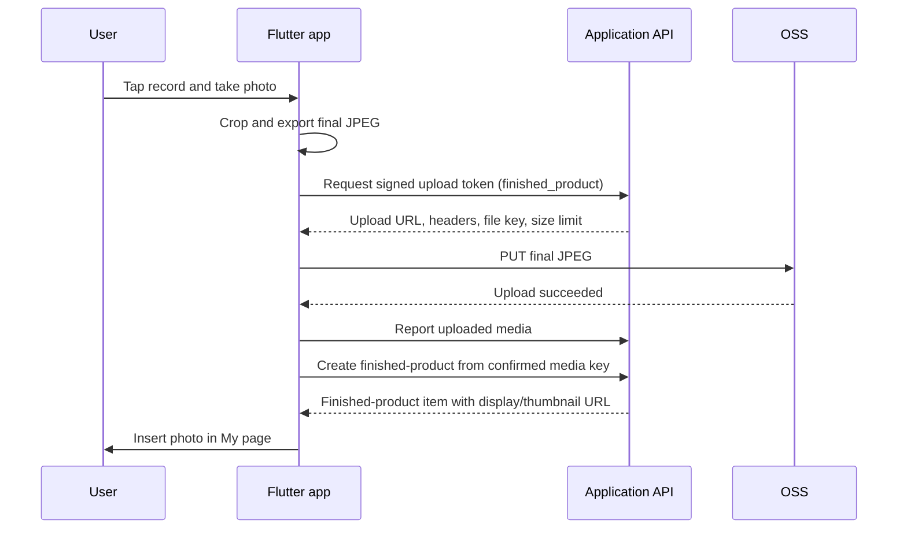

# feat: Record finished bead creations

## Goal Capsule

- **Objective:** Let a user tap “记录一下” on the My page, photograph one finished bead creation, manually crop it with a small surrounding margin, upload only that final crop through the existing signed-object-storage flow, and see the new item on the same page.
- **Scope boundary:** This adds single-photo finished-product records. It does not convert the photo into a pattern, publish it publicly, or retain the uncropped source image on the server.
- **Execution profile:** Flutter/iOS client change plus a small backend API contract for a new user-owned resource.
- **Stop conditions:** The flow is cancelled, camera permission is denied, crop validation fails, upload fails, or record creation fails; in each case no incomplete item is shown as published.

---

## Product Contract

### Problem Frame

The My page currently renders a Figma placeholder for “我的成品”, and its “记录一下” action only shows a coming-soon message.
Users need a lightweight way to preserve a real photo of a completed bead project without uploading distracting surroundings or confusing the record with a generated pattern work.

### Requirements

- R1. Tapping “记录一下” opens the rear iOS system camera and allows the user to cancel without changing the page.
- R2. After taking a photo, the user enters a crop screen with a square crop frame by default, pinch/drag repositioning, and a visible safe margin guide so the finished bead creation and a small edge remain inside the output.
- R3. The client normalizes orientation, removes camera metadata by re-encoding, exports one JPEG crop at a bounded display resolution and size, and uploads that crop only.
- R4. The upload uses a short-lived server-issued object-storage upload URL/policy; permanent OSS/RAM credentials never enter the app.
- R5. The client confirms the upload with the application backend, then creates a user-owned finished-product record from the confirmed media key.
- R6. The My page loads the user’s recent finished products, displays image, loading, empty, and recoverable-error states, and inserts a successfully created item immediately.
- R7. Permission denial, unsupported/invalid image, oversized crop, expired upload authorization, network failure, and duplicate taps have intentional, recoverable UI behavior.

### Scope Boundaries

- **In scope:** One camera photo per invocation, manual crop, private user-owned record, recent list/carousel on My page, retry before record creation.
- **Deferred for later:** Album selection, multi-photo posts, automatic bead-object detection, editing/deleting a record, captions/tags, social sharing, and cloud retry after app termination.
- **Outside this feature:** Pattern generation and the existing generated-work (`/api/v1/works`) lifecycle.

---

## Planning Contract

### Key Technical Decisions

- KTD1. **Create a separate finished-product resource rather than reuse `WorkItem`.** Existing works require generated-pattern fields and represent a different business object; a photo-only record should not fake those fields.
- KTD2. **Reuse the existing signed PUT media path.** `MediaRepository` already obtains a token, uploads bytes without the app’s bearer header to the storage host, and reports the upload. Use a new `purpose: finished_product`, then create the finished-product record only after that report succeeds.
- KTD3. **Manual crop, square default, no automatic recognition in v1.** A user can judge the product boundary more reliably than a first-pass detector. The crop overlay conveys the intended margin; the user may zoom and pan to retain a non-zero visible border.
- KTD4. **Upload an export, never the camera original.** The camera file is transient local input. Re-encode a normalized JPEG (initially 1600 px maximum side at quality 85) to remove camera metadata, enforce the server token’s maximum size before PUT, and retain the crop bytes in memory only for an explicit retry. The backend may derive a thumbnail asynchronously, but the original photo is not persisted.
- KTD5. **Server owns access control and object naming.** The token endpoint binds the upload to the signed-in user, `finished_product` purpose, allowed content type/byte size, object-key prefix, and a short expiry; a per-submission client request ID binds token refreshes and record creation to one server-side object. The record endpoint verifies the reported media belongs to that user and has not already been claimed.
- KTD6. **Use an explicit camera-permission adapter for the denial path.** `image_picker` remains the system-camera launcher, while a small wrapper around `permission_handler` checks/re-requests camera permission and opens the app’s Settings screen after permanent denial. This keeps platform-channel details out of the page widget and testable.

### High-Level Technical Design

### Backend Contract

The client repository does not contain the API server, so these endpoints are a prerequisite contract for the backend team.

| Endpoint | Request | Success response / client use |
| --- | --- | --- |
| `POST /api/v1/media/upload-token` | Existing payload plus `purpose: "finished_product"`; `file_name`, `content_type: "image/jpeg"`, `client_request_id` | Existing `UploadToken`; restrict URL/key/policy to the authenticated user, JPEG content, expected max bytes, and short expiry. Reissuing a token for the same request ID must target the same user-owned object. |
| `PUT <uploadUrl>` | Exported JPEG and exactly the returned required headers | Storage success only; no application authorization header. |
| `POST /api/v1/media/report-upload` | Existing `file_key`, `file_size` | Existing confirmed media key/URL. Reject an absent, expired, over-limit, wrong-owner, or wrong-purpose object. |
| `POST /api/v1/finished-products` | `{ "media_file_key": "…", "client_request_id": "…" }` | `{ "item": { "finishedProductId", "imageUrl", "thumbnailUrl", "createdAt" } }`; idempotent by `client_request_id`. |
| `GET /api/v1/finished-products?cursor=&limit=12` | Authenticated request | `{ "items": [...], "nextCursor": "…" }`; return only the caller’s records, newest first. |

The backend should generate a thumbnail or image-processing variant and return a CDN URL with the correct cache policy. Object keys and private-bucket access must remain server-controlled; the client must not construct OSS paths.

### Assumptions

- “边缘” means a small visual margin around the bead work, not a pixel-perfect automatic outline extraction.
- The Figma source defines the My-page surface, but no capture/crop flow has been supplied; v1 will follow the app’s existing crop interaction while retaining the Figma square-product presentation.
- Guest sessions already created by `BackendServices.auth` may create and later read only their own finished-product records; account migration behavior is a backend follow-up.

---

## Implementation Units

### U1. Finished-product API and domain boundary

- **Goal:** Establish typed client models and repository methods for the photo-only resource without changing generated-work semantics.
- **Requirements:** R4, R5, R6, R7.
- **Dependencies:** Backend contract availability.
- **Files:** `lib/services/api/api_models.dart`, `lib/services/api/api_repositories.dart`, `lib/services/api/api_scope.dart`, `test/services/api_client_test.dart`.
- **Approach:**
  1. Add `FinishedProductItem` and cursor-page decoding beside the existing API models, with only the identity, display URL, thumbnail URL, and timestamp required for My-page rendering.
  2. Add a `FinishedProductRepository` that delegates image bytes to existing `MediaRepository.uploadBytes` with the new purpose, then creates and lists finished-product records.
  3. Expose the repository through `BackendServices`; keep authentication, authorization-refresh, API-error parsing, and object-storage PUT behavior in the existing shared services.
  4. Generate one client request ID per crop submission, include it in token and record requests, and treat repeated responses for that ID as the same success, never as two gallery items.
- **Patterns to follow:** `MediaRepository.uploadBytes`, `WorkRepository.listWorks`, typed API models in `api_models.dart`, and MockClient-based API assertions in `test/services/api_client_test.dart`.
- **Test scenarios:**
  - A valid JPEG requests a token with `purpose: finished_product`, PUTs only the returned bytes/headers to the storage host, reports the returned key, and creates one record.
  - Listing decodes items and a non-empty next cursor, while a missing/empty list produces an empty page.
  - An expired or rejected token, storage non-2xx response, report failure, and record-create failure surface the existing typed API error and do not return an item.
  - Repeating token or create requests with the same client request ID targets one object and yields one item rather than a duplicate.
- **Verification:** The repository can be exercised entirely against mocked API/storage hosts and never sends the bearer token to the storage URL.

### U2. Camera-to-final-crop image pipeline

- **Goal:** Turn a single camera capture into a privacy-preserving, display-ready finished-product JPEG.
- **Requirements:** R1, R2, R3, R7.
- **Dependencies:** U1 for the export constraints; existing `image_picker` and `image` dependencies.
- **Files:** `pubspec.yaml`, `lib/services/camera_permission_service.dart` (new), `lib/services/image_service.dart`, `lib/services/crop_service.dart`, `lib/screens/finished_product_crop_screen.dart` (new), `test/services/crop_service_test.dart`, `test/services/camera_permission_service_test.dart` (new), `test/screens/finished_product_crop_screen_test.dart` (new).
- **Approach:**
  1. Add `permission_handler` and a camera-permission service, then add a camera-specific image acquisition method that requests the camera permission, chooses `ImageSource.camera`, rear camera, `requestFullMetadata: false`, and a capture limit suitable for a 1600 px final export rather than reusing the 800 px pattern-conversion limit.
  2. Extract or adapt the existing transform crop mechanics into a reusable crop surface, but make the finished-product route return final bytes rather than navigating into style conversion or parameter configuration.
  3. Use a locked 1:1 output frame in v1 and add an inset guide labelled as safe margin; the guide is advisory, while crop bounds guarantee no blank regions.
  4. Decode/normalize orientation, crop to the selected transform, resize as needed, re-encode JPEG to remove metadata, and reject zero-size, undecodable, or token-limit-exceeding output before upload.
  5. Present cancel/back, processing, crop-error, and retry states; never leave a progress overlay active after route disposal.
- **Patterns to follow:** Camera picking in `lib/screens/upload_screen.dart`, transform math and gesture rebound in `lib/screens/crop_screen.dart`, byte transforms in `CropService`, and responsive crop tests in `test/screens/crop_screen_responsive_test.dart`.
- **Test scenarios:**
  - A camera capture opens the finished-product crop route; cancellation returns no image and does not start upload.
  - First-use permission prompts once; denied and permanently denied permission produces the respective retry/Settings action without invoking the picker.
  - Pan, pinch, and an edge crop export exactly the selected square area, preserve a visible margin selected by the user, and never expose empty canvas pixels.
  - Landscape, portrait, and EXIF-rotated images produce an upright square JPEG with bounded dimensions and no carried-over camera metadata.
  - Corrupt bytes, an empty crop, and an encoded file larger than the token limit show a recoverable error without calling U1.
  - The crop route lays out without exceptions at 375×667, 390×844, and 430×932.
- **Verification:** A real-device smoke test takes a photo, crops it, and confirms that only the export—not the original camera file—is passed to the upload repository.

### U3. My-page state and published-product presentation

- **Goal:** Replace the static finished-work placeholder with actual user records while preserving the Figma layout when there are none.
- **Requirements:** R1, R5, R6, R7.
- **Dependencies:** U1, U2.
- **Files:** `lib/screens/my_screen.dart`, `test/screens/my_screen_test.dart`.
- **Approach:**
  1. Convert only the My-content/works-section ownership needed for asynchronous state into stateful UI; preserve the current scaled Figma canvas and bottom-navigation behavior.
  2. Load the recent page from `BackendScope` when available and render loading skeleton, empty placeholder, error-with-retry, and image-card states in the existing square region.
  3. Wire “记录一下” to the camera/crop route; disable duplicate invocation while capture, crop confirmation, or upload is active.
  4. After record creation succeeds, prepend the returned item to in-memory state, reset the visible page/carousel to it, and show a brief success acknowledgement; retain existing items on refresh failure.
  5. When the injected permission service reports a permanent denial, explain why it is needed and call its Settings action rather than silently falling back to the photo library.
- **Patterns to follow:** `BackendScope.maybeOf` defensive access in `my_screen.dart`, in-place tab content in `UploadScreen`, and the project’s `MockClient` widget tests.
- **Test scenarios:**
  - Empty, loading, success, and list-fetch-error states are visually reachable without layout exceptions on compact and large iPhone viewports.
  - Tapping “记录一下” invokes camera capture once and a successful crop/upload immediately renders the returned thumbnail at the front.
  - A denied permission, cancelled picker, crop cancellation, and failed upload retain the prior gallery and re-enable the button.
  - While capture/upload is active, repeated taps produce no additional picker, token, PUT, report, or create request.
  - A retry from the error state reloads the first page and replaces the error view on success.
- **Verification:** Widget tests cover the state transitions and a manual iPhone check confirms safe-area, scroll, and keyboard-independent layout.

### U4. iOS privacy copy and end-to-end contract hardening

- **Goal:** Make the camera request truthful and ensure the feature cannot publish unsafe or unowned objects.
- **Requirements:** R3, R4, R7.
- **Dependencies:** U1–U3.
- **Files:** `ios/Runner/Info.plist`, `test/services/api_client_test.dart`, `test/screens/my_screen_test.dart`.
- **Approach:**
  1. Update the existing camera privacy string to explicitly state that photos are used to record a finished bead creation; retain the already-present camera/photo-library keys required by the current picker configuration.
  2. Add API-contract regression coverage for ownership/purpose/size failures returned by the backend and signed-URL expiry retry before the record has been created, reusing the same client request ID and file key.
  3. Document the launch prerequisite for the backend: least-privilege upload policy, short expiry, `finished_product` prefix, MIME/size validation, object ownership validation at report/create, and private read or CDN signed access if records are not intentionally public.
- **Test scenarios:**
  - The iOS plist contains a user-facing camera usage description aligned with the feature.
  - A wrong-purpose, wrong-owner, missing-object, or oversize report/create response is shown as failed and never inserts a published card.
  - An upload URL expiry before PUT obtains a fresh token for the same client request ID and file key; expiry after a confirmed upload does not create a second record.
- **Verification:** Validate the app on a physical iPhone, including first-time permission prompt, denied-permission recovery, and an actual OSS-backed upload under a non-production test prefix.

---

## Verification Contract

| Gate | Applies to | Done signal |
| --- | --- | --- |
| Dart formatting and static analysis | U1–U4 | New code follows the existing Flutter/Dart style with no analyzer errors. |
| Service/API tests | U1, U4 | Mocked flow proves signed PUT headers, reporting, errors, and idempotency. |
| Widget/responsive tests | U2, U3 | 375×667, 390×844, and 430×932 render all flow states without exceptions. |
| Physical-iPhone smoke test | U2–U4 | Camera, crop gesture, permission recovery, real signed upload, and immediate gallery insert work. |
| Backend integration check | U1, U4 | User A cannot create/list User B’s record, and the app has no permanent OSS credential or arbitrary object key. |

---

## Definition of Done

- The My-page button opens the camera and the user can cancel at every pre-publish stage.
- The only server-stored image is the final, correctly oriented crop with the bead work and user-selected surrounding edge.
- Upload authorization is short-lived, scoped, and server-issued; the record can only reference a confirmed media object owned by the current user.
- The My page faithfully handles loading, empty, successful, retryable failure, and duplicate-tap states without disturbing existing generated-work behavior.
- Unit/widget/API coverage and a physical-iPhone smoke test pass for the stated scenarios.

---

## Sources & Research

- The existing client already implements signed media uploads through `MediaRepository` and verifies in tests that the application bearer token is not sent to the storage host.
- The current app already declares iOS camera and photo-library usage keys, and uses `image_picker` for camera acquisition.
- Alibaba Cloud recommends server-issued temporary credentials or signed URLs for direct OSS client uploads rather than storing long-term credentials in the client; a signed PUT URL suits this one-file flow. [Alibaba Cloud OSS direct client upload guidance](https://help.aliyun.com/en/oss/user-guide/uploading-objects-to-oss-directly-from-clients/)
- `image_picker` supports taking a camera photo and documents the required iOS privacy entries. [image_picker documentation](https://pub.dev/packages/image_picker)
